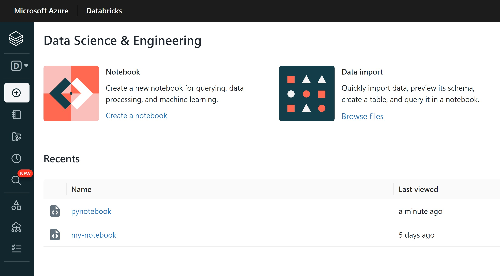
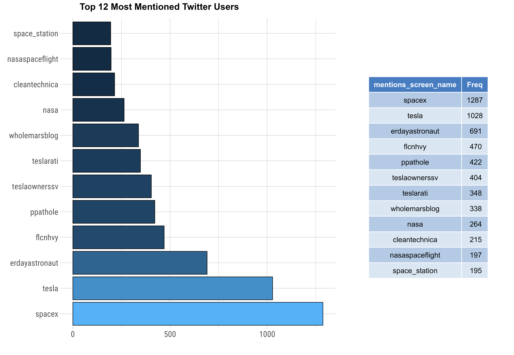
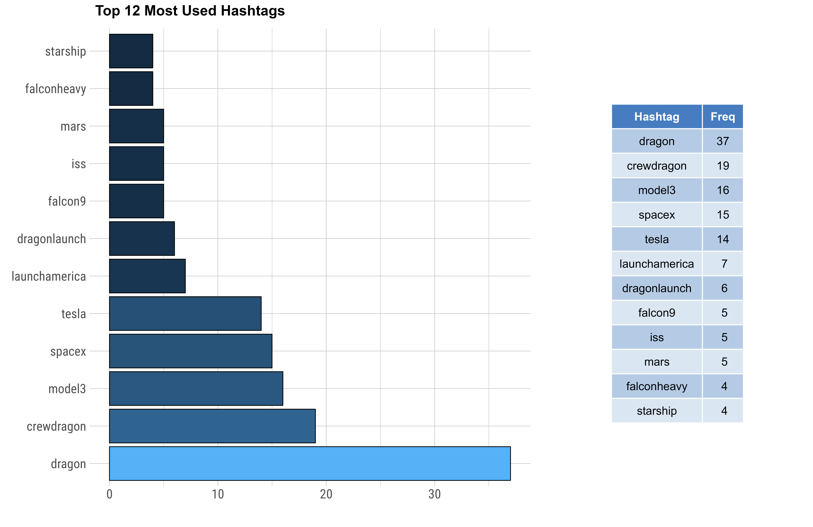
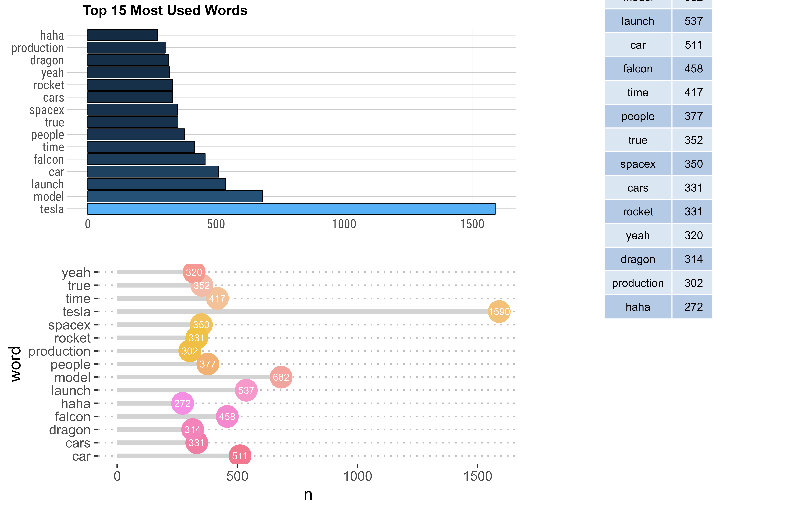

```{r setup, include=FALSE}
knitr::opts_chunk$set(echo = FALSE, message = FALSE, warning = FALSE, fig.align = "center")
library(dplyr)
library(twitteR)
library(tidyverse)
library(kableExtra)
library(lubridate)
library(scales)
library(tidyr)
library(ggplot2)
library(tidytext)
library(quanteda)
library(hrbrthemes)
library(httr)
library(devtools)
library(plyr)												
library(readr)
library(plotly)
library(rtweet)
library(syuzhet)
library(textfeatures)
library(gridExtra)
library(patchwork)
library(ggpubr)
library(pagedown)
source("scripts/data.R")
```


<script src="assets/min.js"></script>
<script src="//cdnjs.cloudflare.com/ajax/libs/highlight.js/9.12.0/highlight.min.js"></script>


## Introduction

<div class = "datasource2">

`Apache Spark` is an open-source engine for large-scale parallel data processing known for its speed, ease of use, and cutting-edge analytics. 

- It provides high-level APIs in general-purpose programming languages such as Scala, Python, and R, as well as an optimization engine that supports standard data analysis methods. 
- It also supports many built-in libraries that fulfill users' needs, including Spark SQL for DataFrames, Spark pandas API for pandas workloads, MLlib for machine learning, Graphx for graph visualizations, and Structured Streaming for workflow processing. 


`Azure Databricks` is an analytics platform based on Microsoft Azure cloud services, providing the latest versions of Apache Spark and allowing consistent integration with open source libraries. Built with Spark capabilities, Azure Databricks provides a cloud platform with interactive workspaces and fully managed Spark clusters. 

- Such capabilities allow users to create and configure clusters in seconds, gain instant access to Apache Spark capabilities, and build quickly with Azure's global scale and availability. 
- The analytics platform includes an easy setup, streamlined workflow, and an integrated Azure Workspace, allowing users to work in a single, easy-to-use environment and quickly schedule Spark code developed on Apache Spark. 
    

</div>


\ 


### Data Description


<div class = "roundedlist22">

<span class="myhighlight">Twitter (Elon Musk 2015-2022):</span> Dataset of Elon Musk’s most recent Tweets during 2015-2022, stored in JSON format, where each tweet is in its own separate JSON object. All Tweets are collected, parsed, and plotted using <code>rtweet</code> in R. In total, there are more than thousands of tweets in this dataset, including retweets and replies. All objects are to go into a single database.

</div>


```{r, out.width="100%"}
kable(dfvar, escape = FALSE, col.names = NULL) %>% kable_styling(font_size = 15, bootstrap_options = c("striped", "hover"), html_font = "Roboto Condensed") %>% column_spec(c(1, 3, 5, 7), extra_css = c("font-weight: 700; font-family: Roboto; font-size: 16px;"), width = "1cm") %>% 
  add_header_above(c("Data Set Variables" = 8), align = "l", extra_css = c("text-transform: uppercase;"), font_size = 15) 


```


#### Twitter API


Once you have your twitter app setup and loaded the `rtweet` package in R, you can run the following command to generate a token for the Twitter data. The first thing that you need to setup in your code is your authentication and then create a token that authenticates access to tweets.


```{r, echo=TRUE, eval=FALSE}
library(rtweet)

twitter_token <- create_token(
  app = "AppName",
  consumer_key = < api_key > ,
  consumer_secret = < api_key_secret > ,
  access_token = < access_token > ,
  access_secret = < access_token_secret >
)

use_oauth_token(twitter_token)
```


Now we search Twitter's full archive API. We run the `search_fullarchive` command in order to be able to access historical tweets from a user. The example below captures all of Elon Musk's tweets from January 01, 2010 to May 28, 2022.


```{r, echo=TRUE, eval=FALSE}
users <- "elonmusk"
musktweets <- search_fullarchive(
  paste0("from:", users),
  n = < number of tweets >, 
  env_name = < enviroment-name >,
  fromDate = < YYMMDDHHMM >,
  toDate = < YYMMDDHHMM >
)
```


<span class="myhighlight">Data Preview: </span>


```{r}
tweetDF2 <- tweetDF %>% select(-status_id, -symbols)
kable(tweetDF2, escape = F) %>% 
  kable_styling(font_size = 13, html_font = "Roboto Condensed", bootstrap_options = c("striped")) %>%
  column_spec(c(3:4), width_max = "2.5cm", extra_css = c("font-size: 11px;")) %>%
  column_spec(1, extra_css = c("font-size: 11.25px;"), width_min = "2cm") %>%
  row_spec(0, extra_css = c("font-weight: 700; font-size: 11px; padding: 3.5pt; text-transform: lowercase;")) %>%
  scroll_box(width = "100%", extra_css = "overflow-x: overlay !important; border: none !important;")

```


------------------------------------


### Questions of Interest


<div class = "roundedlist">

1. `(path finding)` Display the thread (replies) of tweets (the tweet, time, id, in reply to id, user name with their screen name) posted by Elon Musk with screen_name in the order in which they were posted.
2. `(location)` From which location have the tweets been most actively posted (most number of tweets)?
3. `(hashtags)` Which hashtags does Musk use the most, and how many tweets are associated with these hashtags?
4. `(topics)` What word does Musk mention the most in his tweets? What company products does Musk mention the most in his tweets? Products include Falcon 9, Starlink Satellites, Model 3 cars, etc. 
5. `(trending)` Are there any trends of what Musk tweets about the company?
6. `(nature of engagement)` What is the percentage of different types of tweets (simple tweet, reply, retweet, quoted tweet) to their overall number of tweets?


</div>


------------------------------------


### Storing Data in Databricks


<span class="myhighlight2">Building a Databricks workspace using an Apache Spark cluster. </span>

First, we create a Databricks workspace from the Azure portal and then launch the workspace, which redirects us to the interactive Databricks portal. We create a Spark cluster from the Databricks interactive workspace and configure a notebook on the cluster. In the notebook, we use <code>PySpark</code> to read data from a dataset into a Spark DataFrame. Using the Spark DataFrame, we can run a Spark SQL job to query the data.


<div class = "datasource">

```{r, out.width="50%", fig.show='hold'}

```

</div>


The `Databricks File System` (DBFS) is a distributed system that scales to an Azure Databricks workspace and builds on a Databricks cluster. FileStore is a specific folder in DBFS where users can import and store data files from their local computer into a DBFS web browser. The Spark API can then read the imported data into an Apache Spark DataFrame. For example, we can import a CSV file from our local machine into a table using the Create Table UI in the Azure Databricks workspace portal. 


```python
twitter_df = spark.read.csv(path = 'dbfs:/FileStore/dfclean.csv', 
                            header = "true", multiLine = "true")

# Register table so it is accessible via SQL Context
twitter_df.createOrReplaceTempView('twitter_df')
```


The Azure Databricks system stores this data file in FileStore, located in the /FileStore/tables folder. We can then use the following `PySpark` command to read this data. 


------------------------------------


## Querying Twitter Data


Users can perform relational procedures on DataFrames using a domain-specific language (DSL) similar to R dataframes and Python Pandas. DataFrames support standard relational operators, including projection (`select`), filter (`where`), `join`, and aggregations (`group by`).


```{r}
kable(userDF, escape = F, align = "c") %>%
  kable_material("striped", full_width = F, html_font = "Roboto Condensed") %>% 
  kable_styling(font_size = 12)
```


### Query 1. <code>(mentions)</code> 

<div class = "datasource2">
Display the thread (mentions) of tweets (the tweet, time, id, in mention to id, user name with their screen name) posted by Elon Musk with screen_name in the order in which they were posted.
</div>


```python
from pyspark.sql.functions import col

mentionDF = spark.sql(
  "SELECT screen_name, \
          created_at, \
          text, \
          mentions_user_id, \
          mentions_screen_name \
  FROM twitter_df"
)

mentionDF.filter(col("mentions_user_id") != "NA") \
    .write \
    .format('csv') \
    .mode('overwrite') \
    .option("overwriteSchema", "true") \
    .saveAsTable("mentionDF")

mentionDF.createOrReplaceTempView('mentionDF')
display(spark.read.table("mentionDF"))
```


```{r}
reply.data <- tweets.clean %>% dplyr::filter(mentions_user_id != 'NA') %>% dplyr::select(screen_name, text, created_at, mentions_user_id, mentions_screen_name) %>% head(4)

kable(reply.data, escape = FALSE) %>% kable_styling(font_size = 14, bootstrap_options = c("striped", "hover"), html_font = "Roboto Condensed")
```


<span class="myhighlight2">SQL: </span>

```sql
SELECT mentions_screen_name,
  COUNT(*) AS n
FROM mentionDF
WHERE mentions_screen_name != 'NA'
GROUP BY mentions_screen_name
SORT BY n DESC;
```


#### Graphic Report 1.

```{r, fig.show='hold', out.width="75%"}
dfMent <- data.frame(dfMentions) %>% head(12)
colnames(dfMent) <- c("mentions_screen_name", "Freq")

plotMentions <- dfMent %>%
  ggplot(aes(y = mentions_screen_name, x = Freq, fill = Freq)) +
  geom_bar(stat = "identity", color = "black", cex = 0.25)  +
  xlab(NULL) + ylab(NULL) +
  theme_ipsum_rc(base_size = 9, plot_margin = margin(20,8,20,8),
                  plot_title_size = 10) + 
  theme(legend.position = "none")


stable.p <- ggtexttable(dfMent, rows = NULL, 
                        theme = ttheme("mBlue", base_size = 8))

ggarr1 <- ggarrange(plotMentions, stable.p, widths = c(2, 1), heights = c(1, 1), labels = c("Top 12 Most Mentioned Twitter Users"), font.label = list(size = 10, family = "Roboto"))

ragg::agg_png(filename = "assets/static/report1.png", width = 7087, height = 4895, units = "px", res = 900)
ggarr1
invisible(dev.off())

```


-------------------------------


### Query 2. <code>(types)</code> 


<div class = "datasource2">
What is the percentage of different types of tweets (simple tweet, reply, retweet, quoted tweet) to their overall number of tweets?
</div>


#### Create Managed Tables


When you create a `managed table`, Spark will manage both the table data and the metadata. In particular data is written in the default Hive warehouse. We want to create a table for each tweet type. Below we visualize the different tweet types and frequency from Elon Musk.


```sql
CREATE TABLE tweet_type (
    status_id INT auto_increment PRIMARY KEY,
    tweet_variant VARCHAR(50),
    user_name VARCHAR(50),
    created_at DATE,
    tweet_text TEXT
);
```

```{r,  warning=FALSE, message=FALSE}
tweets.plot1 <- ggplot(tweet.types, aes(y= type)) + geom_bar(width = 0.75, fill = "cornflowerblue", color = "navy") + theme_ipsum_rc(base_size = 12)
ggplotly(tweets.plot1)
```


So, the different tweet types are `retweet`, `quoted`, `reply_to`, and `normal`. Now, let's create a table based on Elon Musk's retweets.


```sql
CREATE TABLE data_retweets (
  retweet_status_id CHAR, 
  retweet_text TEXT, 
  retweet_created_at DATE,
  retweet_source TEXT,
  retweet_favorite_count INT,
  retweet_retweet_count INT,
  retweet_user_id CHAR,
  retweet_screen_name TEXT,
  retweet_name TEXT,
  retweet_followers_count INT,
  retweet_friends_count INT,
  retweet_statuses_count INT,
  retweet_location TEXT,
  retweet_description TEXT,
  retweet_verified BOOLEAN
);
```


```{r}
kbl.retweet

```


```sql
SELECT retweet_screen_name, 
       COUNT(status_id) AS cnt
FROM data_retweets
GROUP BY retweet_screen_name
SORT BY cnt DESC;
```


```{r, message=FALSE, warning=FALSE, fig.show='hold', out.width="75%"}
df.retweet2 <- df.retweet %>%
  dplyr::count(retweet_screen_name, sort = TRUE) %>%
  head(15) %>%
  dplyr::mutate(retweet_screen_name = reorder(retweet_screen_name, n))

plotRetweets1 <- df.retweet2 %>% 
  ggplot(aes(y = retweet_screen_name, x = n, fill = n)) +
  geom_bar(stat = "identity", color = "black", cex = 0.25) +
  xlab(NULL) + ylab(NULL) +
  theme_ipsum_rc(base_size = 9, plot_margin = margin(20,8,20,8),
                  plot_title_size = 10) + 
  theme(legend.position = "none")


stable.p <- ggtexttable(df.retweet2, rows = NULL, 
                        theme = ttheme("mBlue", base_size = 8))

ggarrange(plotRetweets1, stable.p, widths = c(2, 1), heights = c(1, 1), labels = c("Top Retweeted Twitter Users"), font.label = list(size = 10, family = "Roboto"))

```


-------------------------------


### Query 3. <code>(tweet trends)</code> 

<div class = "datasource2">
Are there any trends of when Elon Musk tweets?
</div>


#### Datetime Datatype


The following SQL query parses the `created_at` datetime column to display the year, month, day, and hour for each tweet.

```python
from pyspark.sql.types import DateType
twitter_df.withColumn("created_at", twitter_df.created_at.cast(DateType()))
```

```sql
SELECT WEEKDAY(created_at) as created_weekday, 
COUNT(*) as n
FROM twitter_df
GROUP BY created_weekday
ORDER BY created_weekday DESC
```


```{r, out.width="100%"}
plot.weekday <- ggplot(dftweets, aes(x = week)) + geom_bar(stat = "count", width = 0.75, fill = "cornflowerblue", color = "navy") + theme_ipsum_rc(base_size = 8)

ggplotly(plot.weekday)
```


-------------------------------


### Query 4. <code>(hashtags)</code> 

<div class = "datasource2">
Which hashtags does Musk use the most, and how many tweets are associated with these hashtags?
</div>


Here we want to extract hashtags from the content of the Tweets data. The following command unpacks the `hashtags` column into an array of strings, followed by counting how many unique hashtags used by Elon Musk.


```python
hashtagsDF = spark.sql("SELECT \
  hashtags, \
  COUNT(*) AS n \
  FROM twitter_df \
  GROUP BY hashtags")

hashtagsDF.filter(col("hashtags") != "NA") \
     .write \
     .format('csv') \
     .mode('overwrite') \
     .option("overwriteSchema", "true") \
     .saveAsTable("hashtagsDF")
 
display(spark.read.table("hashtagsDF"))
hashtagsDF.createOrReplaceTempView('hashtagsDF')
```


#### Graphic Report 4. 


```{r, fig.show='hold', out.width="100%"}
dfHashtags <- data.frame(dfHashtags) %>% head(12)
colnames(dfHashtags) <- c("Hashtag", "Freq")

plotHashtags <- dfHashtags %>%
  ggplot(aes(y = Hashtag, x = Freq, fill = Freq)) +
  geom_bar(stat = "identity", color = "black", cex = 0.25)  +
  xlab(NULL) + ylab(NULL) +
  theme_ipsum_rc(base_size = 9, plot_margin = margin(20,8,20,8),
                  plot_title_size = 10) + 
  theme(legend.position = "none")

table.htags <- ggtexttable(dfHashtags, rows = NULL, theme = ttheme("mBlue", base_size = 8))

ggarr2 <- ggarrange(plotHashtags, table.htags, widths = c(2, 1), heights = c(1, 1), labels = c("Top 12 Most Used Hashtags"), font.label = list(size = 10, family = "Roboto"))

ragg::agg_png(filename = "assets/static/report2.png", width = 7087, height = 4595, units = "px", res = 900)
ggarr2
invisible(dev.off())


```


-------------------------------


### Query 5. <code>(topics)</code> 


<div class = "datasource2">
What word does Musk mention the most in his tweets? What company products does Musk mention the most in his tweets?
</div>


```python
import pyspark.sql.functions as f
data_df = twitter_df.select('text', 'status_id', 'created_at')

# Count and group word frequencies on text, when split by space comma

data_df.withColumn('word', f.explode(f.split(f.col('text'), ' '))) \
  .groupBy('word') \
  .count() \
  .sort('count', ascending=False) \
  .show()
```


#### Graphic Report 5.


```{r, out.width="100%"}
dfSentWords <- data.frame(df.words) %>% head(15)
 

plotWords <- dfSentWords %>%
  ggplot(aes(y = reorder(word, -n), x = n, fill = n)) +
  geom_histogram(stat = "identity", color = "black", cex = 0.25)  +
  xlab(NULL) + ylab(NULL) +
  theme_ipsum_rc(base_size = 9, plot_margin = margin(20,8,20,8),
                  plot_title_size = 10) + 
  theme(legend.position = "none")

table.words <- ggtexttable(dfSentWords, rows = NULL, theme = ttheme("mBlue", base_size = 8))

ggarr3 <- ggarrange(plotWords, table.words, widths = c(2, 1), heights = c(1, 1), labels = c("Top 15 Most Used Words"), font.label = list(size = 10, family = "Roboto"))

ragg::agg_png(filename = "assets/static/report3.png", width = 7087, height = 4595, units = "px", res = 900)
ggarr3
invisible(dev.off())


```


------------------------------------


## Sentiment Analysis


```{r}
source("scripts/sentiment.R")
```


```{r, warning=FALSE, message=FALSE, out.width="100%"}
ggplotly(tt_sent)
# ggplotly(plot.sent3)
```


```{r}
## plot [smoothing] text features over time
ttplot <- tweets.text %>% gather(feature, n, -hrs) %>%
  ggplot(aes(x = hrs, y = n, colour = feature))  +
  geom_smooth(method = "loess", span = 0.5) +
  facet_wrap(~feature, ncol = 6) + 
  theme_ipsum_rc(base_size = 6, axis_text_size = 6, axis_title_size = 6) +
  theme(axis.text = element_text(size = rel(.68)), 
        strip.text = element_text(size = rel(.75)), 
        strip.text.x = element_text(margin = margin(5, 3, 6, 3, "pt")), panel.grid.major = element_line(colour = "black", size = rel(.08)), panel.grid.minor = element_line(colour = "black", size = rel(.05)), legend.position = "none") +
    labs(x = NULL, y = "Standardized Mean Frequencies")


# ragg::agg_png(filename = "assets/senti1.png", width = 7087, height = 3895, units = "px", res = 900)
# ttplot
# invisible(dev.off())
# knitr::include_graphics("assets/senti1.png")

ggplotly(ttplot)
```


```{r, message=FALSE, warning=FALSE}
fig1 <- ggplotly(plot.sent1)
fig2 <- ggplotly(plot.sent2)

#plot.sent5

fig <- subplot(fig1, fig2, nrows = 1, margin = 0.025, widths = c(0.35, 0.65))
fig
```


```{r}
ggpubr::ggpie(pie_words, "n", label = "sentiment", 
      fill = "sentiment", color = "white", 
      palette = c("blue", "orange", "purple", "yellow", "pink", "green", "aquamarine", "cyan", "violet", "plum"), font.family = "Roboto Condensed") + theme_ipsum()
```


------------------------------------


### References


