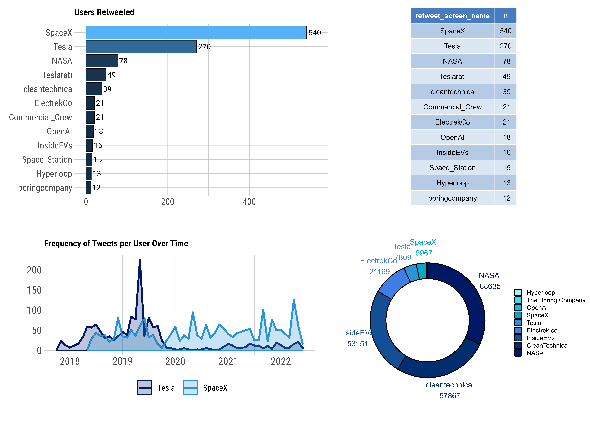
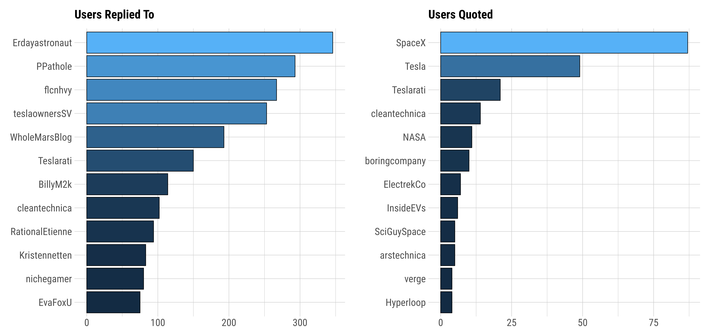
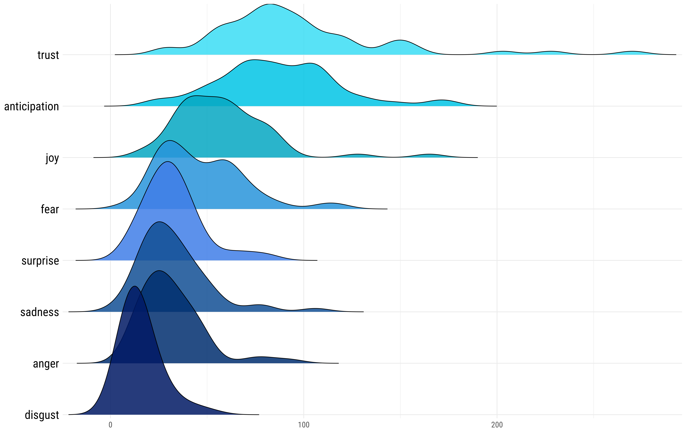

```{r setup, include=FALSE}
knitr::opts_chunk$set(echo = FALSE, message = FALSE, warning = FALSE, fig.align = "center")
library(dplyr)
library(twitteR)
library(tidyverse)
library(kableExtra)
library(lubridate)
library(scales)
library(tidyr)
library(ggplot2)
library(tidytext)
library(quanteda)
library(hrbrthemes)
library(httr)
library(devtools)
library(plyr)												
library(readr)
library(plotly)
library(rtweet)
library(syuzhet)
library(textfeatures)
library(gridExtra)
library(patchwork)
library(ggpubr)
library(pagedown)
source("scripts/data.R")
```


<script src="assets/min.js"></script>
<script src="//cdnjs.cloudflare.com/ajax/libs/highlight.js/9.12.0/highlight.min.js"></script>


<div class = "datasource2">
<span class="myhighlight">Goal:</span> Load Twitter API into a data management system and write queries to retrieve data.

- Dataset of Elon Musk’s most recent Tweets during 2015-2022, stored in csv format, where each tweet is in its own separate row object.
</div>


```{r}
userDF %>% dplyr::select(-description, -name, -favourites_count) %>%
  dplyr::mutate(account_created_at = as_date(account_created_at)) %>%
  kable(escape = F, align = "c") %>%
  kable_styling(font_size = 12, full_width = T, html_font = "Roboto Condensed", bootstrap_options = c("hover", "striped")) %>%
  row_spec(0, font_size = 11) %>%
  scroll_box(width = "100%", extra_css = "overflow-x: overlay !important; border: none !important; margin: 12pt 0px 12pt 0;")

```


## Introduction

<div class = "datasource22">

`Apache Spark` is an open-source engine for large-scale parallel data processing known for its speed, ease of use, and cutting-edge analytics. It provides high-level APIs in general-purpose programming languages such as Scala, Python, and R, as well as an optimization engine supporting standard data analysis methods. 


`Azure Databricks` is an analytics platform based on Microsoft Azure cloud services, providing the latest versions of Apache Spark and allowing consistent integration with open source libraries. Built with Spark capabilities, Databricks provides a cloud platform with an interactive workspace and fully managed Spark clusters, allowing users to work in a single, easy-to-use environment, create and configure clusters in seconds, and quickly execute Spark code.


</div>


### Data Description


<div class = "roundedlist22">

<span class="myhighlight">Twitter (Elon Musk 2015-2022):</span> Dataset of Elon Musk’s most recent Tweets during 2015-2022, stored in RDS format, where each tweet is in its own separate row object. All Tweets are collected, parsed, and plotted using <code>rtweet</code> in R. In total, there are more than thousands of tweets in this dataset, including retweets and replies. All objects are to go into a single database.

</div>


```{r, out.width="100%"}
kable(dfvar, escape = FALSE, col.names = NULL) %>% kable_styling(font_size = 12, bootstrap_options = c("striped", "hover"), html_font = "Roboto Condensed") %>% 
  column_spec(c(1, 3, 5, 7), extra_css = c("font-weight: 700; font-family: Roboto; font-size: 13.5px; text-shadow: 0 1px 1px white, 0.04em 0.04em 0px #0000004d;"), width_max =  "1cm") %>% 
  add_header_above(c("Data Set Variables" = 8), align = "l", extra_css = c("text-transform: uppercase; text-shadow: 0 1px 1px white, 0.04em 0.04em 0px #0000004d;"), font_size = 12) %>% scroll_box(width = "100%", extra_css = "overflow-x: overlay !important; border: none !important; margin: 12pt 0px 12pt 0;")


```


#### Twitter API


Once you have your twitter app setup and loaded the `rtweet` package in R, you can run the following command to generate a token for the Twitter data. The first thing that you need to setup in your code is your authentication and then create a token that authenticates access to tweets.


```{r, echo=TRUE, eval=FALSE}
library(rtweet) # load rtweet package

twitter_token <- create_token(app = "mytwitterapp",
  consumer_key = "api_key", consumer_secret = "api_secret_key",
  access_token = "access_token", access_secret = "access_token_secret")

use_oauth_token(twitter_token) # authenticate via web browser
```


Now we search Twitter's full archive API. We run the `search_fullarchive` command in order to be able to access historical tweets from a user. The example below captures all of Elon Musk's tweets from January 01, 2010 to May 28, 2022.


```{r, echo=TRUE, eval=FALSE}
df <- search_fullarchive(q = "from:elonmusk", n = 10000, env_name = enviroment_name, fromDate = "201001010000", toDate = "202205280000")
```


```{r}
tweetDF2 <- tweetDF %>% select(-status_id, -symbols, -source, -hashtags, -media_type)
kable(tweetDF2, escape = F) %>% 
  kable_styling(font_size = 13, html_font = "Roboto Condensed", bootstrap_options = c("striped")) %>%
  column_spec(c(3:4), width_max = "2.5cm", extra_css = c("font-size: 11px;")) %>%
  column_spec(1, extra_css = c("font-size: 11.25px;"), width_min = "2cm") %>%
  row_spec(0, extra_css = c("font-weight: 700; font-size: 11px;")) %>%
  add_header_above(c("Data Set Preview:" = 9), align = "l", extra_css = c("text-transform: uppercase; text-shadow: 0 1px 1px white, 0.04em 0.04em 0px #0000004d;")) %>%
  scroll_box(width = "100%", extra_css = "overflow-x: overlay !important; border: none !important; margin: 12pt 0px 12pt 0;")

```


### Questions of Interest


<div class = "datasource2">

1. `(path finding)` Display the thread (replies) of tweets (the tweet, time, id, in reply to id, user name with their screen name) posted by Elon Musk with screen_name in the order in which they were posted.
2. `(location)` From which location have the tweets been most actively posted (most number of tweets)?
3. `(hashtags)` Which hashtags does Musk use the most, and how many tweets are associated with these hashtags?
4. `(topics)` What word does Musk mention the most in his tweets? What company products does Musk mention the most in his tweets? Products include Falcon 9, Starlink Satellites, Model 3 cars, etc. 
5. `(trending)` Are there any trends of what Musk tweets about the company?
6. `(nature of engagement)` What is the percentage of different types of tweets (simple tweet, reply, retweet, quoted tweet) to their overall number of tweets?


</div>


------------------------------------


### Storing Data in Databricks


<span class="myhighlight2">Building a Databricks workspace using an Apache Spark cluster. </span>

First, we create a Databricks workspace from the Azure portal and then launch the workspace, which redirects us to the interactive Databricks portal. We create a Spark cluster from the Databricks interactive workspace and configure a notebook on the cluster. In the notebook, we can use either `PySpark` or `SparkR` to read data from a dataset into a Spark DataFrame. Using the Spark DataFrame, we can run a Spark SQL job to query the data.


<div class = "datasource">

```{r, out.width="50%", fig.show='hold'}
knitr::include_graphics("assets/static/workspace.jpeg")
```

</div>


The Azure Databricks system stores this data file in FileStore, located in the *FileStore/* folder, which we then use the following PySpark or SparkR command to read in the data as a dataframe.


<span class="myhighlight2">Python Code: </span>


```python
df = spark.read.csv(path = 'dbfs:/FileStore/dfclean.csv',
                    header = "true", multiLine = "true")

# register table so it is accessible via SQL Context
df.createOrReplaceTempView('twitterTemp')
```

<span class="myhighlight2">R Code: </span>

```{r, eval=FALSE, echo=TRUE}
require(SparkR)
df <- read.df("dbfs:/FileStore/dfclean.csv", source = "csv", 
              header="true", inferSchema = "true")
createOrReplaceTempView(df, "twitterTemp") # register table
```


FileStore is a specific folder in DBFS where users can import and store data files from their local computer into a DBFS web browser. The Spark API then reads the imported data into an Apache Spark DataFrame as shown above.


------------------------------------


## Querying Twitter Data


Users can perform relational procedures on DataFrames using a domain-specific language (DSL) similar to R dataframes and Python Pandas. DataFrames support standard relational operators, including projection (`select`), filter (`where`), `join`, and aggregations (`group by`).


### Query 1. Mentions

<div class = "datasource2">
- Display the thread (replies) of tweets (the tweet, time, id, in mention to id, user name with their screen name) posted by Elon Musk with screen_name in the order in which they were posted.
</div>


<span class="myhighlight2">Python Code: </span>

```python
mentionDF = spark.sql("SELECT created_at, text, \
    mentions_user_id, mentions_screen_name \
    FROM twitterTemp")
mentionDF.filter(mentionDF.mentions_user_id != "NA")
mentionDF.createOrReplaceTempView('mentionDF')
```

<span class="myhighlight2">R Code: </span>

```{r, echo=TRUE, eval=FALSE}
require(SparkR)
mentionDF <- select(df, "created_at", "text",
    "mentions_user_id", "mentions_screen_name")
mentionDF <- filter(mentionDF, mentionDF$mentions_user_id != "NA")
createOrReplaceTempView(mentionDF, "mentionDF")
```


\ 


```{r}
reply.data <- tweets.clean %>% dplyr::filter(mentions_user_id != 'NA') %>% dplyr::select(created_at, text, mentions_user_id, mentions_screen_name) %>% head(4)

kable(reply.data, escape = FALSE) %>% 
  kable_styling(font_size = 12, bootstrap_options = c("striped", "hover"), html_font = "Roboto Condensed", full_width = F)
```


<span class="myhighlight2">SQL Query: </span>

```sql
SELECT mentions_screen_name,
  COUNT(*) AS n
FROM mentionDF
WHERE mentions_screen_name != 'NA'
GROUP BY mentions_screen_name
SORT BY n DESC;
```


```{r, fig.show='hold', out.width="100%"}
dfMent <- data.frame(dfMentions) %>% head(12)
colnames(dfMent) <- c("mentions_screen_name", "Freq")

plotMentions <- dfMent %>%
  ggplot(aes(y = mentions_screen_name, x = Freq, fill = Freq)) +
  geom_bar(stat = "identity", color = "black", cex = 0.25)  +
  xlab(NULL) + ylab(NULL) +
  theme_ipsum_rc(base_size = 9, plot_margin = margin(20,8,20,8),
                  plot_title_size = 10) + 
  theme(legend.position = "none")


stable.p <- ggtexttable(dfMent, rows = NULL, 
                        theme = ttheme("mBlue", base_size = 8))

ggarr1 <- ggarrange(plotMentions, stable.p, widths = c(2, 1), heights = c(1, 1), labels = c("Top 12 Most Mentioned Twitter Users"), font.label = list(size = 10, family = "Roboto"))

ragg::agg_png(filename = "assets/static/report1.png", width = 7087, height = 4895, units = "px", res = 900)
ggarr1
invisible(dev.off())
knitr::include_graphics("assets/static/report1.png")
```


-------------------------------


### Query 2. Types


<div class = "datasource2">
- What is the percentage of different types of tweets (simple tweet, reply, retweet, quoted tweet) to their overall number of tweets?
</div>


When creating a `managed table`, Spark will manage both the table data and the metadata. To obtain the percentage of different types of tweets, we begin by creating a managed table for each tweet type (simple, reply, retweet, quote). The following R command returns Elon Musk's different tweet types and overall frequency.


<span class="myhighlight2">R Code: </span>

```{r, echo=TRUE, eval=FALSE}
retweets <- nrow(df[df$is_retweet == "TRUE", ])
quotes <- nrow(df[df$is_quote == "TRUE", ])
normal <- nrow(df[df$is_quote == "FALSE" & df$is_retweet == "FALSE", ])
replies <- nrow(df[df$reply_to_status_id != "NA", ])

data <- data.frame(type = c("retweet", "quote", "regular", "reply"),
  n = c(retweets, quotes, normal, replies))

typeDF <- createDataFrame(data)
createOrReplaceTempView(typeDF, "typeDF")
```


```{r,  warning=FALSE, message=FALSE, out.width="100%"}
tweets.plot1 <- ggplot(tweet.types) + geom_bar(mapping = aes(x = type, y = n), stat="identity", width = 0.75, fill = "cornflowerblue", color = "navy") +
  theme_ipsum_rc(base_size = 9, plot_margin = margin(20,8,20,8),
                  plot_title_size = 10) + 
  theme(legend.position = "none", axis.text.x = element_text(size = 10, face = "bold")) +
  xlab(NULL) + ylab(NULL)

dfTypes <- data.frame(tweet.types)
colnames(dfTypes) <- c("Type", "n")

table.types <- ggtexttable(dfTypes, rows = NULL, theme = ttheme("mBlue", base_size = 12))

ggarrTypes <- ggarrange(tweets.plot1, table.types, widths = c(2, 1), heights = c(1, 1))

ragg::agg_png(filename = "assets/static/tweetTypes.png", width = 7087, height = 4095, units = "px", res = 900)
ggarrTypes
invisible(dev.off())
knitr::include_graphics("assets/static/tweetTypes.png")
```


So the different tweet types are `retweet`, `quoted`, `reply_to`, and `normal`.

Now, let's create a data table to display the information for each of Elon Musk's retweets and query the results to obtain the number of times Musk retweeted each user. With these results, we can visualize the most frequent twitter users Musk retweets as shown in the above graphic report.


```sql
CREATE TABLE retweets (
  retweet_status_id CHAR, 
  retweet_text TEXT, 
  retweet_created_at DATE,
  retweet_source TEXT,
  retweet_favorite_count INT,
  retweet_retweet_count INT,
  retweet_user_id CHAR,
  retweet_screen_name TEXT,
  retweet_name TEXT,
  retweet_followers_count INT,
  retweet_friends_count INT,
  retweet_statuses_count INT,
  retweet_location TEXT,
  retweet_description TEXT,
  retweet_verified BOOLEAN
);

# Load data into table
LOAD DATA INPATH '/user/dfclean' INTO TABLE retweets;
```


<span class="myhighlight">Retweets Table:</span>

```{r}
df.retweet %>% dplyr::select(retweet_status_id, retweet_created_at, retweet_text, retweet_screen_name, retweet_favorite_count, retweet_retweet_count, retweet_followers_count, retweet_location, retweet_description, retweet_verified) %>%
  dplyr::filter(retweet_status_id == "x1519461793604661248" |
                  retweet_status_id == "x715632500303761408" |
                  retweet_status_id == "x805661402937565184" |
                  retweet_status_id == "x1261074546561433601") %>%
  dplyr::arrange(desc(retweet_created_at)) %>% 
  dplyr::select(-retweet_status_id) %>%
  kable(col.names = c("created_at", "text", "screen_name", "favorite_count", "retweet_count", "followers_count", "location", "description", "verified"), escape = F) %>%
  kable_styling(full_width = F, html_font = "Roboto Condensed", font_size = 10, bootstrap_options = c("hover", "striped")) %>%
  add_header_above(c("retweets" = 9), align = "l", extra_css = c("font-weight: 400; letter-spacing: 0.25px; text-transform: uppercase; color: #1d9bf0; font-size: 9pt; text-shadow: 0.15px 0.15px 0.001px #12121240, -0.25px -0.25px 0.2px #d1d6e0f2, 0.25px 0.25px 0.25px #00000080, -0.2px -0.2px 0.1px #1a1a1a40, -0.5px -0.5px 0.2px #e6e6e680, 0.5px 0.5px 0.5px #b3b3b380;")) %>%
  scroll_box(width = "100%", extra_css = "overflow-x: overlay !important; border: none !important; margin: 12pt 0px 12pt 0;")


```


```{r}
source("scripts/sentiment.R")
```

```{r}
dfrt <-  df.retweet %>% dplyr::filter(retweet_screen_name != 'elonmusk') %>% dplyr::count(retweet_screen_name, sort = TRUE) %>% head(12) %>% dplyr::mutate(retweet_screen_name = reorder(retweet_screen_name, n))

plotrt <- dfrt %>% ggplot(aes(y = retweet_screen_name, x = n, fill = n, 
                              label = n)) + 
  geom_bar(stat = "identity", color = "black", cex = 0.25) + 
  geom_text(hjust = -0.15, face="bold", size=3, family="Roboto") + xlim(c(0, 565)) +
  xlab(NULL) + ylab(NULL) + ggplot2::labs(title = "Users Retweeted") + theme_ipsum_rc(base_size = 10, plot_margin = ggplot2::margin(10,10,10,10), plot_title_size =  10) + theme(legend.position = "none")


dfrt <- data.frame(dfrt)
table.RT <- ggtexttable(dfrt, rows = NULL, theme = ttheme("mBlue", base_size = 8))


ggarrRTs <- ggarrange(ggarrange(plotrt, table.RT, ncol=2, widths = c(4, 3)), ggarrange( plot.timeline, plot.donuts, ncol=2, widths = c(5.5,4)), nrow = 2, heights = c(4,4)) 

ragg::agg_png(filename = "assets/static/reportRTs.png", width = 8287, height = 6005, units = "px", res = 900)
ggarrRTs
invisible(dev.off())

```


```{r, out.width="100%"}
dfreplies <- tweets.clean %>% dplyr::select(reply_to_screen_name) %>% dplyr::filter(reply_to_screen_name != 'NA') %>% dplyr::filter(reply_to_screen_name != 'elonmusk') %>% dplyr::count(reply_to_screen_name, sort = TRUE) %>% head(12) %>% dplyr::mutate(reply_to_screen_name = reorder(reply_to_screen_name, n))
plotreplies <- dfreplies %>% ggplot(aes(y = reply_to_screen_name, x = n, fill = n)) + geom_bar(stat = "identity", color = "black", cex = 0.25)  + xlab(NULL) + ylab(NULL) + ggplot2::labs(title = "Users Replied To") + theme_ipsum_rc(base_size = 10, plot_margin = ggplot2::margin(10,10,10,10), plot_title_size =  12)  + theme(legend.position = "none")

dfqt <- tweets.clean %>% dplyr::select(quoted_screen_name) %>% dplyr::filter(quoted_screen_name != 'NA') %>% dplyr::filter(quoted_screen_name != 'elonmusk') %>% dplyr::count(quoted_screen_name, sort = TRUE) %>% head(12) %>% dplyr::mutate(quoted_screen_name = reorder(quoted_screen_name, n))
plotqt <- dfqt %>% ggplot(aes(y = quoted_screen_name, x = n, fill = n)) + geom_bar(stat = "identity", color = "black", cex = 0.25) + xlab(NULL) + ylab(NULL) + ggplot2::labs(title = "Users Quoted") + theme_ipsum_rc(base_size = 10, plot_margin = ggplot2::margin(10,10,10,10), plot_title_size =  12)  + theme(legend.position = "none")


ggarrType <- ggarrange(plotreplies, plotqt, ncol=2, nrow = 1)

ragg::agg_png(filename = "assets/static/reportType.png", width = 8887, height = 4205, units = "px", res = 900)
ggarrType
invisible(dev.off())


```


  


-------------------------------


### Query 3. Trends

<div class = "datasource2">
- Are there any trends of when Elon Musk tweets?
</div>


#### Datetime Datatype


The following SQL query parses the `created_at` datetime column to display the year, month, day, and hour for each tweet.


```{r, echo=TRUE, eval=FALSE}
timeDF <- SparkR::select(df, c("status_id", "created_at"))

timeDF$created_at <- to_timestamp(timeDF$created_at)
timeDF$year <- year(timeDF$created_at)
timeDF$month <- date_format(to_date(timeDF$created_at), "MMMM")
timeDF$weekday <- date_format(to_date(timeDF$created_at), "EEEE")

createOrReplaceTempView(timeDF, "timeDF")
```


The resulting schema for the above dataframe consists of a string, datetime, integer, string, and string for the status_id, created_at, year, month, weekday columns, respectively. 


```{r}
timeDF <- gfg_data %>% dplyr::select(status_id, created_at) %>%
  dplyr::filter(year(created_at) > "2016")
timeDF$year <- year(timeDF$created_at)
timeDF$month <- months(timeDF$created_at) %>% factor(levels = month.name)
timeDF$weekday <- weekdays(timeDF$created_at) %>% factor(levels= c("Sunday", "Monday", "Tuesday", "Wednesday", "Thursday", "Friday", "Saturday"))

time <- as.POSIXct(strptime(hms::hms(hours = hour(timeDF$created_at), minutes = minute(timeDF$created_at)), "%H:%M"), "UTC")
x = as.POSIXct(strptime(c("050000", "105959", "110000", "155959", "160000",  "185959"), "%H%M%S"), "UTC")

timeDF$time <- case_when(
  between(time, x[1], x[2]) ~ "morning",
  between(time, x[3], x[4]) ~ "afternoon",
  between(time, x[5], x[6]) ~ "evening",
  TRUE ~ "night"
) %>% factor(levels = c("morning", "afternoon", "evening", "night"))

timeDF %>% dplyr::select(-status_id) %>% slice_sample(n = 10) %>%
  dplyr::arrange(desc(created_at)) %>% head() %>%
  kable(escape = F) %>%
  kable_styling(full_width = F, html_font = "Roboto Condensed", font_size = 12, bootstrap_options = c("striped", "hover")) %>%
  column_spec(1, extra_css = c("opacity: 0.5; font-weight: 400;"))

```


<span class="myhighlight2">SQL Query: </span>

```sql
SELECT weekday AS created_weekday, COUNT(*) AS n
FROM timeDF
GROUP BY created_weekday
ORDER BY n DESC;
```


```{r, out.width="100%"}
plot.weekday <- ggplot(dftweets, aes(x = week)) + geom_bar(stat = "count", width = 0.75, fill = "cornflowerblue", color = "navy") + theme_ipsum_rc(base_size = 8)

```

```{r, message=FALSE, warning=FALSE, out.width="100%"}
plotyear <- ggplot(timeDF) + geom_bar(mapping = aes(x = year), stat = "count", fill="#A0F5F7", alpha=0.85, color="black") + xlab("year") + ylab(NULL) + theme_ipsum_rc(base_size = 10, plot_margin = ggplot2::margin(10,10,10,10), axis_title_face = "bold", axis_title_size = 10) + theme(axis.title.x = element_text(vjust = 0.25)) 

plotmonth <- ggplot(timeDF) + geom_bar(mapping = aes(x = factor(month, levels = month.name, labels = month.abb)), stat = "count", fill = "#2DDAF4", alpha=0.85, color="black") + xlab("month") + ylab(NULL) + theme_ipsum_rc(base_size = 10, plot_margin = ggplot2::margin(10,10,10,10), axis_title_face = "bold", axis_title_size = 10)  + theme(axis.title.x = element_text(vjust = 0.25)) 

plotday <- ggplot(timeDF) + geom_bar(mapping = aes(x = factor(weekday, levels= c("Sunday", "Monday", "Tuesday", "Wednesday", "Thursday", "Friday", "Saturday"), labels =c("Sun", "Mon", "Tues", "Weds", "Thurs", "Fri", "Sat"))), stat = "count", fill = "#3C84F0", alpha=0.85, color="black") + xlab("weekday") + ylab(NULL) + theme_ipsum_rc(base_size = 10, plot_margin = ggplot2::margin(10,10,10,10), axis_title_face = "bold", axis_title_size = 10)  + theme(axis.title.x = element_text(vjust = 0.25)) 

plottime <- ggplot(timeDF) + geom_bar(mapping = aes(x = time), stat = "count", fill = "#00326F", alpha=0.85, color="black") + xlab("time") + ylab(NULL) + theme_ipsum_rc(base_size = 10, plot_margin = ggplot2::margin(10,10,10,10), axis_title_face = "bold", axis_title_size = 10)  + theme(axis.title.x = element_text(vjust = 0.25)) 

ggarrtime <- ggarrange(plotyear, plotmonth, plotday, plottime, ncol = 2, nrow = 2)

ggarrtime <- annotate_figure(ggarrtime, top = text_grob("Number of Tweets by Datetime", family = "Roboto Condensed", size = 12, hjust = 2.15, vjust = 0.12, face = "bold"))
               
ragg::agg_png(filename = "assets/static/reportDate.png", width = 8287, height = 5095, units = "px", res = 900)
ggarrtime
invisible(dev.off())
knitr::include_graphics("assets/static/reportDate.png")
```


-------------------------------


### Query 4. Hashtags

<div class = "datasource2">
- Which hashtags does Musk use the most, and how many tweets are associated with these hashtags?
</div>


Here we want to extract hashtags from the content of the Tweets data. The following command unpacks the `hashtags` column into an array of strings, followed by counting how many unique hashtags used by Elon Musk.


<span class="myhighlight2">SQL Query: </span>

```sql
SELECT hashtags, COUNT(*) AS hashtagcount
FROM twitterTemp
WHERE hashtags != 'NA'
AND hashtags != '0'
GROUP BY hashtags
SORT BY hashtagcount DESC;
```


```{r, fig.show='hold', out.width="100%"}
dfHashtags <- data.frame(dfHashtags) %>% head(12)
colnames(dfHashtags) <- c("Hashtag", "Freq")

plotHashtags <- dfHashtags %>%
  ggplot(aes(y = Hashtag, x = Freq, fill = Freq)) +
  geom_bar(stat = "identity", color = "black", cex = 0.25)  +
  xlab(NULL) + ylab(NULL) +
  theme_ipsum_rc(base_size = 9, plot_margin = margin(20,8,20,8),
                  plot_title_size = 10) + 
  theme(legend.position = "none")

table.htags <- ggtexttable(dfHashtags, rows = NULL, theme = ttheme("mBlue", base_size = 8))

ggarr2 <- ggarrange(plotHashtags, table.htags, widths = c(2, 1), heights = c(1, 1), labels = c("Top 12 Most Used Hashtags"), font.label = list(size = 10, family = "Roboto"))

ragg::agg_png(filename = "assets/static/report2.png", width = 7087, height = 4595, units = "px", res = 900)
ggarr2
invisible(dev.off())
knitr::include_graphics("assets/static/report2.png")

```


-------------------------------


### Query 5. Topic Words


<div class = "datasource2">
- What word does Musk mention the most in his tweets? What company products does Musk mention the most in his tweets?
</div>


<span class="myhighlight2">Python Code: </span>

```python
import pyspark.sql.functions as f
textDF = df.select('text', 'status_id', 'created_at')

# Count and group word frequencies on text, when split by space comma
textDF.withColumn('word', f.explode(f.split(f.col('text'), ' '))) \
  .groupBy('word') \
  .count() \
  .sort('count', ascending=False)
```

<span class="myhighlight2">R Code: </span>

```{r, echo=TRUE, eval=FALSE}
reg <- c("&amp;|&lt;|&gt;", "[^\x01-\x7F]",
         "\\s?(f|ht)(tp)(s?)(://)([^\\.]*)[\\.|/](\\S*)")

df %>% select('text', 'status_id') %>%
  mutate(text = str_remove_all(text, reg)) %>%
  unnest_tokens(word, text, token = "tweets") %>%
  filter(!word %in% stop_words$word,
         !word %in% str_remove_all(stop_words$word, "'"),
         str_detect(word, "[a-z]"),
         !str_detect(word, "^#@\\S+")) %>%
  count(word, sort = TRUE)
```


```{r, out.width="100%"}
dfSentWords <- data.frame(df.words) %>% head(15)
 

plot.lolli <- ggplot(dfSentWords, aes(x = word, y = n, fill = word)) +
  geom_linerange(
    aes(x = word, ymin = 0, ymax = n),
    color = "lightgray", size = 1.5) +
  geom_point(aes(color = word), size = 7, pch = 21) +
  geom_text(aes(label = n), color = "white", size = 2.5) +
  scale_color_manual(values = mypal5) +
  scale_fill_manual(values = mypal5) +
  theme_pubclean() +
  coord_flip() +
  theme(legend.position = "none")

plotWords <- dfSentWords %>%
  ggplot(aes(y = reorder(word, -n), x = n, fill = n)) +
  geom_histogram(stat = "identity", color = "black", cex = 0.25) +
  xlab(NULL) +
  ylab(NULL) +
  theme_ipsum_rc(base_size = 9, plot_margin = margin(20, 8, 20, 8), plot_title_size = 10) +
  theme(legend.position = "none")

table.words <- ggtexttable(dfSentWords, rows = NULL, theme = ttheme("mBlue", base_size = 8))

ggarr3 <- ggarrange(plotWords, table.words, plot.lolli, 
                    ncol = 2, nrow = 2,
                    widths = c(2, 1), heights = c(1, 1), 
                    labels = c("Top 15 Most Used Words"), 
                    font.label = list(size = 10, family = "Roboto"))


ragg::agg_png(filename = "assets/static/report3.png", width = 7087, height = 4595, units = "px", res = 900)
ggarr3
invisible(dev.off())
knitr::include_graphics("assets/static/report3.png")
```


------------------------------------


## Sentiment Analysis


```{r}
source("scripts/sentiment.R")
```


Here we use the `syuzhet` R package to iterate over a vector of strings consisting of the text from all of Elon Musk's tweets in our dataset. To obtain the vector of tweet text, the plain_tweets() function from the `rtweet` package is used to clean up the tweets character vector to cleaned up, plain text. We then pass this vector to the get_sentiment() function, which consequently returns the sentiment values based on the custom sentiment dictionary developed from a collection of human coded sentences.


<span class="myhighlight2">R Code: </span>

```{r,echo=TRUE}
round_time <- function(x, secs)
  as.POSIXct(hms::round_hms(x, secs))
sent_scores <- function(x)
  syuzhet::get_sentiment(plain_tweets(x)) - .5

df.sentiment <- gfg_data %>%
  dplyr::mutate(days = round_time(created_at, 60 * 60 * 24),
                sentiment = sent_scores(text)) %>%
  dplyr::group_by(days) %>%
  dplyr::summarise(sentiment = sum(sentiment, na.rm = TRUE))
```


```{r}
sentPreview <- df.sentiment %>%
  dplyr::arrange(desc(days)) %>%
  head(5) %>%
  kable(col.names = c("date", "sentiment")) %>%
  kable_styling(full_width = FALSE, html_font = "Roboto Condensed", bootstrap_options = c("striped", "hover")) %>%
  row_spec(0, extra_css = c("font-size: 10pt; text-transform: uppercase; font-weight: 400; letter-spacing: 0.5px; text-shadow: 1px 1px 1px rgb(0 0 0 / 20%); font-family: Roboto;")) %>%
  column_spec(1, extra_css = c("color: grey;"))
```


```{r, warning=FALSE, message=FALSE, out.width="100%"}
ggplotly(tt_sent)
# ggplotly(plot.sent3)
```


ext Mining: Sentiment Analysis
Once we have cleaned up our text and performed some basic word frequency analysis, the next step is to understand the opinion or emotion in the text. This is considered sentiment analysis and this tutorial will walk you through a simple approach to perform sentiment analysis.

To perform sentiment analysis we need to have our data in a tidy format. The following converts all seven Harry Potter novels into a tibble that has each word by chapter by book. See the tidy text tutorial for more details.


Using the same package, we now use the `get_nrc_sentiment()` function to get the emotions and valences from the NRC sentiment dictionary for each tweet. First, we must clean the text column from our dataset  

This syuzhet function calculates the presence of emotions and their valence for each tweet, where the text is cleaned so that each row holds a sentence from our dataset. 


The columns include one for each emotion type as well as a positive or negative valence. The ten columns are as follows: "anger", "anticipation", "disgust", "fear", "joy", "sadness", "surprise", "trust", "negative", "positive."

<span class="myhighlight2">R Code: </span>

```{r, eval=FALSE, echo=TRUE}
cleanTweet  = as.vector(df$text)
cleanTweet = gsub("rt|RT", "", cleanTweet)
cleanTweet = gsub("http\\w+", "", cleanTweet)
cleanTweet = gsub("<.*?>", "", cleanTweet)
cleanTweet = gsub("@\\w+", "", cleanTweet)
cleanTweet = gsub("[[:punct:]]", "", cleanTweet)
cleanTweet  = gsub("\r?\n|\r", " ", cleanTweet)
cleanTweet = gsub("[[:digit:]]", "", cleanTweet)
cleanTweet = gsub("[ |\t]{2,}", "", cleanTweet)
cleanTweet = gsub("^ ", "", cleanTweet)
cleanTweet = gsub(" $", "", cleanTweet)

textSentiment <- get_nrc_sentiment(cleanTweet)
nrc_sentiment <- cbind(df, textSentiment) %>% 
  dplyr::select(created_at, anger, anticipation, disgust, fear, 
                joy, sadness, surprise, trust, negative, positive)
```


```{r, out.width="100%"}
ggsenti1 <- ggarrange(plot.sent1, plot.sent1B, widths = c(5, 4)) +
  labs(subtitle = "Sentiment")

ragg::agg_png(filename = "assets/static/senti1.png", width = 8087, height = 4295, units = "px", res = 900)
ggsenti1
invisible(dev.off())
knitr::include_graphics("assets/static/senti1.png")

```


```{r}
# ggsenti3 <- ggarrange(plot.ridges1, plot.ridges2, widths = c(5, 4))

ragg::agg_png(filename = "assets/static/ridgeplot.png", width = 8687, height = 5495, units = "px", res = 900)
plot.ridges1
invisible(dev.off())

```


```{r, out.width="100%"}
ggsenti2 <- ggarrange(plot.sent2, plot.sent3, ncol = 2, nrow = 1, align = "hv", widths = c(4, 3))

ragg::agg_png(filename = "assets/static/senti2.png", width = 8887, height = 3095, units = "px", res = 900)
ggsenti2
invisible(dev.off())
knitr::include_graphics("assets/static/senti2.png")
```


```{r}
plot.sent2A
plot.sent2B
plotRadar
```


```{r}
myradarChart(radarDF2, colors_border, colors_in, mytitle)
```


------------------------------------


### References


