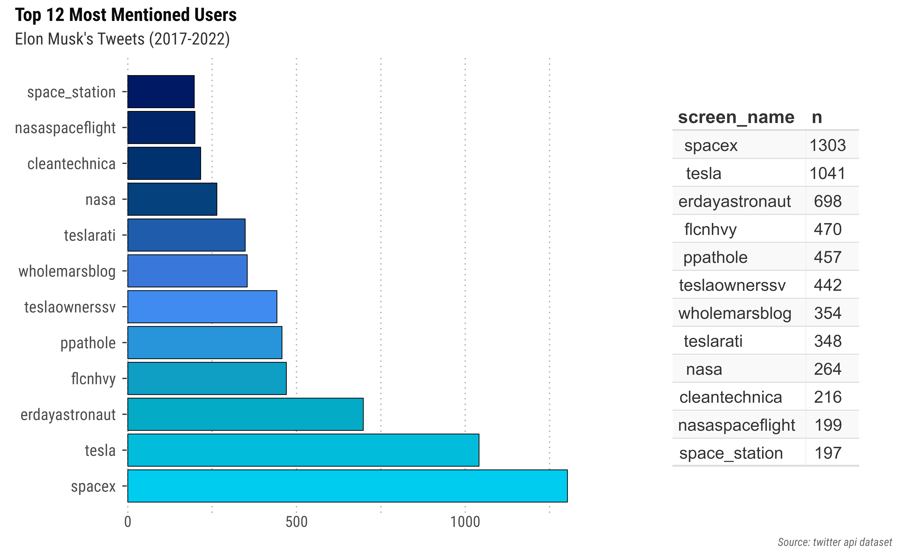
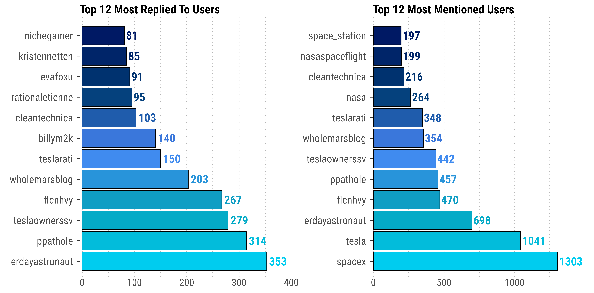
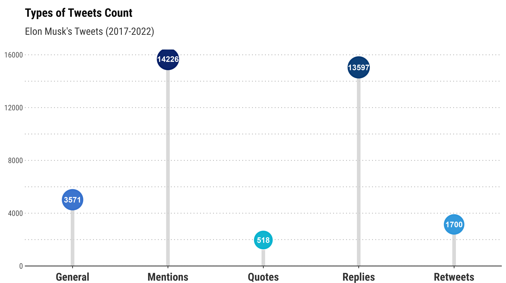
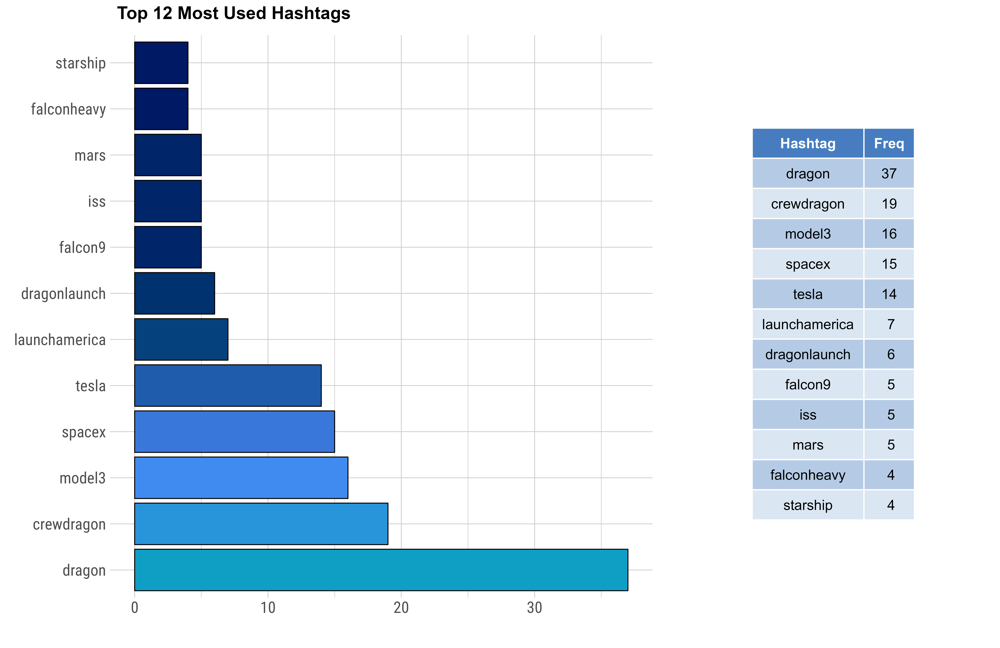
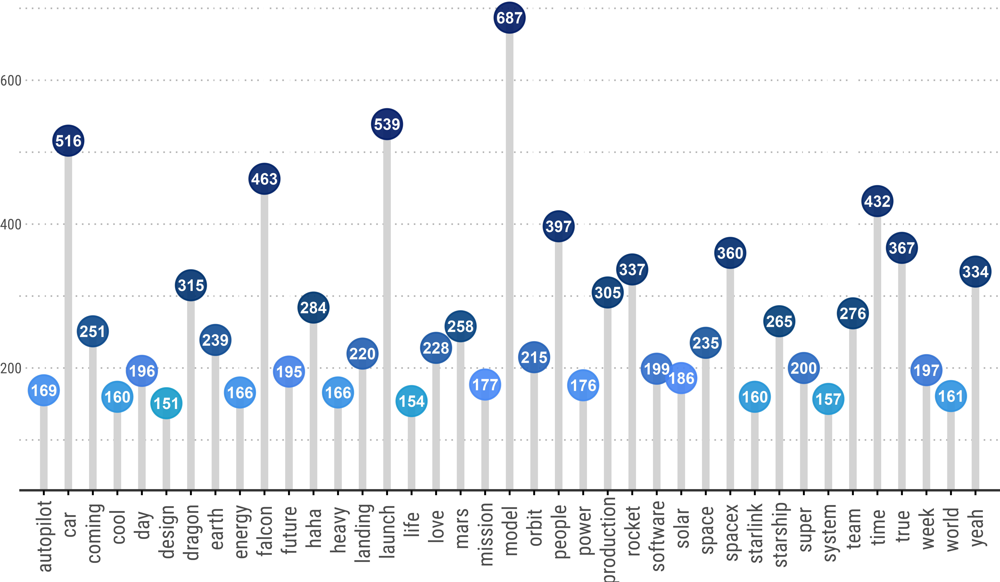
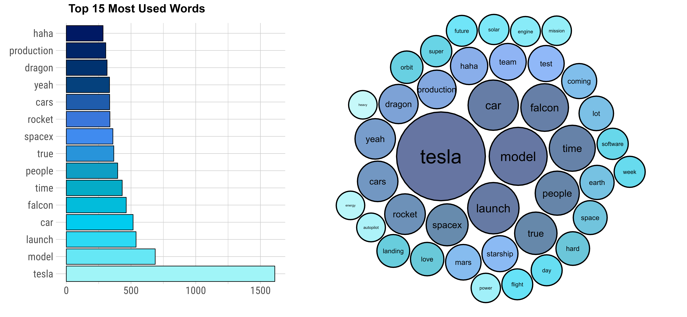

```{r setup, include=FALSE}
knitr::opts_chunk$set(echo = FALSE, message = FALSE, warning = FALSE, fig.align = "center")
library(dplyr)
library(twitteR)
library(tidyverse)
library(kableExtra)
library(lubridate)
library(scales)
library(tidyr)
library(ggplot2)
library(tidytext)
library(quanteda)
library(hrbrthemes)
library(httr)
library(devtools)
library(plyr)												
library(readr)
library(plotly)
library(rtweet)
library(syuzhet)
library(textfeatures)
library(gridExtra)
library(patchwork)
library(ggpubr)
library(pagedown)
library(packcircles)
source("scripts/data.R")
source("scripts/sentiment.R")
```


<script src="assets/min.js"></script>
<script src="assets/min.r.js"></script>
<script src="//cdnjs.cloudflare.com/ajax/libs/highlight.js/9.12.0/highlight.min.js"></script>


<div class = "datasource2">
<span class="myhighlight">Goal:</span> Load Twitter API into a data management system and write queries to retrieve data.

- Dataset of Elon Musk’s most recent Tweets during 2015-2022, stored in csv format, where each tweet is in its own separate row object.
</div>


```{r}
userDF %>% dplyr::select(-description, -name, -favourites_count) %>%
  dplyr::mutate(account_created_at = as_date(account_created_at)) %>%
  kable(escape = F, align = "c") %>%
  kable_styling(font_size = 12, full_width = T, html_font = "Roboto Condensed", bootstrap_options = c("hover", "striped")) %>%
  row_spec(0, font_size = 11) %>%
  scroll_box(width = "100%", extra_css = "overflow-x: overlay !important; border: none !important; margin: 12pt 0px 12pt 0;")

```


## Introduction

<div class = "datasource22">

`Apache Spark` is an open-source engine for large-scale parallel data processing known for its speed, ease of use, and cutting-edge analytics. It provides high-level APIs in general-purpose programming languages such as Scala, Python, and R, as well as an optimization engine supporting standard data analysis methods. 


`Azure Databricks` is an analytics platform based on Microsoft Azure cloud services, enabling the latest versions of Apache Spark and open source libraries. Built with Spark capabilities, Databricks provides a cloud-based interactive workspace with fully managed Spark clusters. This allows users to work in a single, easy-to-use environment, create and configure clusters in seconds, and quickly execute Spark code.


</div>


### Data Description


<div class = "roundedlist22">

<span class="myhighlight">Twitter (Elon Musk 2015-2022):</span> Dataset of Elon Musk’s most recent Tweets during 2015-2022, stored in RDS format, where each tweet is in its own separate row object. All Tweets are collected, parsed, and plotted using <code>rtweet</code> in R. In total, there are more than thousands of tweets in this dataset, including retweets and replies. All objects are to go into a single database.

</div>


```{r, out.width="100%"}
kable(dfvar, escape = FALSE, col.names = NULL) %>% kable_styling(font_size = 12, bootstrap_options = c("striped", "hover"), html_font = "Roboto Condensed") %>% 
  column_spec(c(1, 3, 5, 7), extra_css = c("font-weight: 700; font-family: Roboto; font-size: 13.5px; text-shadow: 0 1px 1px white, 0.04em 0.04em 0px #0000004d;"), width_max =  "1cm") %>% 
  add_header_above(c("Data Set Variables" = 8), align = "l", extra_css = c("text-transform: uppercase; text-shadow: 0 1px 1px white, 0.04em 0.04em 0px #0000004d;"), font_size = 12) %>% scroll_box(width = "100%", extra_css = "overflow-x: overlay !important; border: none !important; margin: 12pt 0px 12pt 0;")
```


#### Twitter API


After setting up the Twitter application and loading the `rtweet` package in R, we use the following command to create a token with application authentication, allowing access to Twitter data. 


```{r, echo=TRUE, eval=FALSE}
library(rtweet) # load rtweet package
twitter_token <- create_token(
  app = "mytwitterapp",
  consumer_key = "api_key", consumer_secret = "api_secret",
  access_token = "access_token", access_secret = "access_secret")
use_oauth_token(twitter_token) # authenticate via web browser
```


Now, we search Twitter's full archive API, running the `search_fullarchive` command for access to user historical tweets. The example below captures Elon Musk's tweets from January 01, 2010, to May 28, 2022.


```{r, echo=TRUE, eval=FALSE}
df <- search_fullarchive(q = "from:elonmusk", n = 10000, env_name = enviroment_name, fromDate = "201001010000", toDate = "202205280000")
```


```{r}
tweetDF2 <- tweetDF %>% select(-status_id, -symbols, -source, -hashtags, -media_type)
kable(tweetDF2, escape = F) %>% 
  kable_styling(font_size = 13, html_font = "Roboto Condensed", bootstrap_options = c("striped")) %>%
  column_spec(c(3:9), width_max = "2.5cm", extra_css = c("font-size: 11px;")) %>%
  column_spec(1, extra_css = c("font-size: 11.25px;"), width_min = "2cm") %>%
  row_spec(0, extra_css = c("font-weight: 700; font-size: 11px;")) %>%
  add_header_above(c("Data Set Preview:" = 9), align = "l", 
  extra_css = c("font-weight: 400; letter-spacing: 0.25px; text-transform: uppercase; color: #1d9bf0; font-size: 9pt; text-shadow: 0.15px 0.15px 0.001px #12121240, -0.25px -0.25px 0.2px #d1d6e0f2, 0.25px 0.25px 0.25px #00000080, -0.2px -0.2px 0.1px #1a1a1a40, -0.5px -0.5px 0.2px #e6e6e680, 0.5px 0.5px 0.5px #b3b3b380; text-align: left;")) %>%
  scroll_box(width = "100%", extra_css = "overflow-x: overlay !important; border: none !important; margin: 12pt 0px 12pt 0;")

```


### Questions of Interest


<div class = "datasource2">

1. `(path finding)` Display the thread (replies) of tweets (the tweet, time, id, in reply to id, user name with their screen name) posted by Elon Musk with screen_name in the order in which they were posted.
2. `(location)` From which location have the tweets been most actively posted (most number of tweets)?
3. `(hashtags)` Which hashtags does Musk use the most, and how many tweets are associated with these hashtags?
4. `(topics)` What word does Musk mention the most in his tweets? What company products does Musk mention the most in his tweets? Products include Falcon 9, Starlink Satellites, Model 3 cars, etc. 
5. `(trending)` Are there any trends of what Musk tweets about the company?
6. `(nature of engagement)` What is the percentage of different types of tweets (simple tweet, reply, retweet, quoted tweet) to their overall number of tweets?


</div>


------------------------------------


### Storing Data in Databricks


<span class="myhighlight">Building a Databricks workspace using an Apache Spark cluster. </span>

First, we create a Databricks workspace from the Azure portal and then launch the workspace, which redirects us to the interactive Databricks portal. We create a Spark cluster from the Databricks interactive workspace and configure a notebook on the cluster. In the notebook, we can use either **PySpark** or **SparkR** to read data from a dataset into a Spark DataFrame. Using the Spark DataFrame, we can run a Spark SQL job to query the data.


<span class="myhighlight2">R Code: </span>

```{r, eval=FALSE, echo=TRUE}
require(SparkR)
df <- read.df("dbfs:/FileStore/dfclean.csv", source = "csv", 
              header = "true", inferSchema = "true")
createOrReplaceTempView(df, "twitterTemp") # register table for SQL
```


The Azure Databricks system stores this data file in FileStore, located in the *FileStore/* folder, which we then use the above SparkR command to read in the data as a dataframe.


------------------------------------


## Querying Twitter Data


Users can perform relational procedures on DataFrames using a domain-specific language (DSL) similar to R dataframes and Python Pandas. DataFrames support standard relational operators, including projection (`select`), filter (`where`), `join`, and aggregations (`group by`).


### Query 1. Mentions

<div class = "datasource2">
- Track Elon Musk's engagement with other twitter users and display the corresponding thread of tweets posted by Musk (tweet content, date posted, users in tweet).
</div>


To track Elon Musk's engagement with people on Twitter, we want to look into tweets containing conversations with and directed to other users. We begin by unpacking information for each of Elon Musk's tweets that mention another person's username. Specifically, **mentions** are a type of tweet containing other account usernames, preceded by the "@" symbol. 


<span class="myhighlight2">R Code: </span>

```{r, echo=TRUE, eval=FALSE}
dfMentions <- SparkR::select(df, "created_at", "mentions_user_id",
                     "mentions_screen_name", "text")
dfMentions <- SparkR::filter(dfMentions, dfMentions$mentions_user_id != NA)
createOrReplaceTempView(dfMentions, "dfMentions")
```


```{r}
dfMentions <- subset(gfg_data, !is.na(gfg_data$mentions_user_id)) %>% dplyr::select(created_at, mentions_user_id, mentions_screen_name, text)

tail(dfMentions, 50)[c(7, 10, 29, 48),] %>% 
  kable(escape = FALSE) %>% 
  kable_styling(full_width = F, html_font = "Roboto Condensed", font_size = 10, bootstrap_options = c("hover", "striped")) %>%
  add_header_above(c("Mentions" = 4), extra_css = c("font-weight: 400; letter-spacing: 0.25px; text-transform: uppercase; color: #1d9bf0; font-size: 9pt; text-shadow: 0.15px 0.15px 0.001px #12121240, -0.25px -0.25px 0.2px #d1d6e0f2, 0.25px 0.25px 0.25px #00000080, -0.2px -0.2px 0.1px #1a1a1a40, -0.5px -0.5px 0.2px #e6e6e680, 0.5px 0.5px 0.5px #b3b3b380; text-align: left;"))
```


As shown above, there exist tweets containing multiple mentioned *usernames* within the body of the text, all grouped together in a single row. So now we must manipulate the data so that each mentioned user for a tweet forms its own row, which allows us to count the total number of times Musk mentioned a unique user.


```{r, echo=TRUE, eval=FALSE}
dfMentions %>%
  tibble(user = str_extract_all(text, "@\\w+")) %>%
  tidyr::unnest_longer(user) %>%
  dplyr::count(user, sort = TRUE)
```


The above command uses the `str_extract_all()` function to extract the mentioned users for each tweet and `unnest_longer()` to transform the nested lists into tidy rows so that each row contains only one user. Lastly, we count the total number of observations for each unique user.


<span class="myhighlight2">SQL Query: </span>

```sql
SELECT mentions_screen_name, COUNT(*) AS n
FROM mentionDF
WHERE mentions_screen_name != 'NA'
GROUP BY mentions_screen_name
SORT BY n DESC;
```


```{r, fig.show='hold', out.width="100%"}
topMentions <- plot.Mentions + table.Mentions + plot_annotation(
  title = "Top 12 Most Mentioned Users",
  subtitle = "Elon Musk's Tweets (2017-2022)",
  caption = "Source: twitter api dataset")

topMentions <- topMentions + plot_annotation(
  theme = theme(text = element_text(family = "Roboto Condensed"),
    plot.title = element_text(size = 13.25, colour = "gray5", face = "bold"), 
    plot.subtitle = element_text(size = 12, colour = "gray20"), 
    plot.caption = element_text(size = 8, face = "italic", colour = "gray40"))) + 
  plot_layout(widths = c(2, 1))


ragg::agg_png(filename = "assets/static/userMentions.png", width = 8887, height = 5495, units = "px", res = 1000)
topMentions
invisible(dev.off())

```


SpaceX and Tesla are the most frequently mentioned users in Musk's tweets. Linking conversations together, a **reply** is a type of tweet sent in direct response to another user's tweet. Similar to mentions, replies allow users to direct tweets toward other twitter users and interact in conversations. Following the same general procedure above, we obtain the following results.


```{r, out.width="100%"}
topReply <- (plotReplies + ggtitle("Top 12 Most Replied To Users") +
               theme(plot.title = element_text(size = 13, margin = ggplot2::margin(b=-1)))) +
  (plot.Mentions2 + ggtitle("Top 12 Most Mentioned Users") +
               theme(plot.title = element_text(size = 13, margin = ggplot2::margin(b=-1))))

topReply <- topReply + plot_annotation(
  theme = theme(text = element_text(family = "Roboto Condensed"),
    plot.title = element_text(size = 13.25, colour = "gray5", face = "bold"), 
    plot.subtitle = element_text(size = 12, colour = "gray20")))


ragg::agg_png(filename = "assets/static/topReplies.png", width = 9487, height = 4695, units = "px", res = 1050)
topReply
invisible(dev.off())



```


-------------------------------


### Query 2. Types


<div class = "datasource2">
- What is the percentage of different types of tweets (simple tweet, reply, retweet, quoted tweet) to their overall number of tweets?
</div>

The different type of tweets that exist are **general tweets**, **mentions**, **replies**, **retweets**, and **quotes**. The mention and reply tweet types are already defined in the previous section. General tweets are original twitter posts containing text, photos, a GIF, and/or video, but do **not** include any mentions, replies, retweets, or quotes. Lastly, retweets and quotes are both re-postings of another person's tweet, although quotes allow users to post another person's tweet with their own added comment.


<span class="myhighlight2">R Code: </span>


```{r, echo=TRUE, eval=FALSE}
nGeneral <- nrow(df[df$is_retweet == FALSE, ] %>% # removes retweets
                   subset(is.na(reply_to_status_id))) # removes replies
nMentions <- nrow(subset(df, !is.na(df$mentions_user_id)))
nReplies <- nrow(subset(df, !is.na(df$reply_to_status_id)))
nRetweets <- nrow(nRetweets <- df[df$is_retweet == TRUE, ])
nQuotes <- nrow(df[df$is_quote == TRUE, ])

tweetTypes <- data.frame(
  type = c("General", "Mentions", "Replies", "Retweets", "Quotes"),
  count = c(nGeneral, nMentions, nReplies, nRetweets, nQuotes))
```


In the above, we create five different data sets either containing only general tweets, mentions, replies, retweets, or quotes. We then count the number of observations for each data set and store it in a separate data frame containing the tweet type and its respective count.


```{r,  warning=FALSE, message=FALSE, out.width="95%"}
plotTypes <- lolli.types + 
  labs(title = "Types of Tweets Count", subtitle = "Elon Musk's Tweets (2017-2022)") + 
  theme(text = element_text(family = "Roboto Condensed"),
        plot.title = element_text(size = 14, colour = "gray5", face = "bold"), 
        plot.subtitle = element_text(size = 12, colour = "gray20"))


ragg::agg_png(filename = "assets/static/tweetTypes.png", width = 7487, height = 4205, units = "px", res = 900)
plotTypes
invisible(dev.off())

```


Now, let's display a table holding information for each of Elon Musk's retweets and query the data to obtain the usernames of Musk's most frequently retweeted users. To identify the most frequently retweeted users, we use tidyr tools to unnest, count, and sort each user from Musk's retweets.


```{r, echo=TRUE, eval=FALSE}
dfRetweet <- df %>% dplyr::filter(is_retweet == TRUE) %>%
  dplyr::select(
    retweet_created_at, retweet_text, retweet_user_id,
    retweet_screen_name, retweet_favorite_count,
    retweet_retweet_count, retweet_location) %>%
  dplyr::arrange(desc(retweet_created_at))

dfRetweet %>% group_by(retweet_screen_name) %>%
  tally(sort = TRUE)
```


```{r}
retweetKable <- gfg_data %>% 
  dplyr::filter(is_retweet == TRUE) %>%
  dplyr::select(retweet_status_id,retweet_created_at, retweet_text, retweet_user_id, retweet_screen_name, retweet_favorite_count, retweet_retweet_count, retweet_location) %>%
  dplyr::filter(retweet_status_id == "x1519461793604661248" |
                  retweet_status_id == "x715632500303761408" |
                  retweet_status_id == "x805661402937565184" |
                  retweet_status_id == "x1261074546561433601") %>%
  dplyr::select(-retweet_status_id) %>%
  dplyr::arrange(desc(retweet_created_at)) %>% 
  kable(col.names = c("created_at", "text", "user_id", "screen_name", "favorite_count", "retweet_count", "location"), escape = F) %>%
  kable_styling(full_width = F, html_font = "Roboto Condensed", font_size = 10, bootstrap_options = c("hover", "striped")) %>%
  add_header_above(c("retweets" = 7), align = "l", extra_css = c("font-weight: 400; letter-spacing: 0.25px; text-transform: uppercase; color: #1d9bf0; font-size: 9pt; text-shadow: 0.15px 0.15px 0.001px #12121240, -0.25px -0.25px 0.2px #d1d6e0f2, 0.25px 0.25px 0.25px #00000080, -0.2px -0.2px 0.1px #1a1a1a40, -0.5px -0.5px 0.2px #e6e6e680, 0.5px 0.5px 0.5px #b3b3b380;")) %>%
  scroll_box(width = "100%", extra_css = "overflow-x: overlay !important; border: none !important; margin: 12pt 0px 12pt 0;")


retweetKable
```


```{r}
topRetweets <- plotRetweet + #tableRetweet + 
  plot_annotation(
  title = "Top 12 Most Retweeted Users",
  subtitle = "Elon Musk's Tweets (2017-2022)",
  caption = "Source: twitter api dataset")

topRetweets <- topRetweets + plot_annotation(
  theme = theme(text = element_text(family = "Roboto Condensed"),
    plot.title = element_text(size = 13.25, colour = "gray5", face = "bold"), 
    plot.subtitle = element_text(size = 12, colour = "gray20"), 
    plot.caption = element_text(size = 8, face = "italic", colour = "gray40")))  


# ragg::agg_png(filename = "assets/static/topRetweets.png", width = 8887, height = 5895, units = "px", res = 1050)
# topRetweets
# invisible(dev.off())
# knitr::include_graphics("assets/static/topRetweets.png")

```


```{r}
#user <- c("SpaceX", "Tesla", "NASA", "cleantechnica", "ElectrekCo", "OpenAI", "InsideEVs", "Hyperloop", "boringcompany")
#u <- lookup_users(user)

```


  


-------------------------------


### Query 3. Trends

<div class = "datasource2">
- Are there any trends of when Elon Musk tweets?
</div>


#### Datetime Datatype


The following parses the `created_at` datetime column to display the year, month, day, and hour for each tweet.


```{r, echo=TRUE, eval=FALSE}
dfTime <- select(df, c("status_id", "created_at"))
dfTime$created_at <- to_timestamp(dfTime$created_at)
dfTime$year <- year(dfTime$created_at)
dfTime$month <- date_format(to_date(dfTime$created_at), "MMMM")
dfTime$weekday <- date_format(to_date(dfTime$created_at), "EEEE")

createOrReplaceTempView(dfTime, "dfTime")
```


The resulting schema for the above dataframe consists of a string, datetime, integer, string, and string for the status_id, created_at, year, month, weekday columns, respectively. 


```{r}
dfTime %>% dplyr::select(-status_id) %>% slice_sample(n = 10) %>%
  dplyr::arrange(desc(created_at)) %>% head() %>%
  kable(escape = F) %>% 
  kable_styling(full_width = F, html_font = "Roboto Condensed", font_size = 12, bootstrap_options = c("striped", "hover")) %>% 
  column_spec(1, extra_css = c("opacity: 0.5;"))

```


<span class="myhighlight2">SQL Query: </span>

```sql
SELECT weekday AS created_weekday, COUNT(*) AS n
FROM dfTime
GROUP BY created_weekday
ORDER BY n DESC;
```


```{r, message=FALSE, warning=FALSE, out.width="100%"}
plotYear <- ggplot(dfTime) + geom_bar(mapping = aes(x = year), stat = "count", fill="#A0F5F7", alpha=0.85, color="black") + xlab("year") + ylab(NULL) + theme_ipsum_rc(base_size = 10, plot_margin = ggplot2::margin(10,10,10,10), axis_title_face = "bold", axis_title_size = 10) + theme(axis.title.x = element_text(vjust = 0.25)) 

plotMonth <- ggplot(dfTime) + geom_bar(mapping = aes(x = factor(month, levels = month.name, labels = month.abb)), stat = "count", fill = "#2DDAF4", alpha=0.85, color="black") + xlab("month") + ylab(NULL) + theme_ipsum_rc(base_size = 10, plot_margin = ggplot2::margin(10,10,10,10), axis_title_face = "bold", axis_title_size = 10)  + theme(axis.title.x = element_text(vjust = 0.25)) 

plotDay <- ggplot(dfTime) + geom_bar(mapping = aes(x = factor(weekday, levels= c("Sunday", "Monday", "Tuesday", "Wednesday", "Thursday", "Friday", "Saturday"), labels =c("Sun", "Mon", "Tues", "Weds", "Thurs", "Fri", "Sat"))), stat = "count", fill = "#3C84F0", alpha=0.85, color="black") + xlab("weekday") + ylab(NULL) + theme_ipsum_rc(base_size = 10, plot_margin = ggplot2::margin(10,10,10,10), axis_title_face = "bold", axis_title_size = 10)  + theme(axis.title.x = element_text(vjust = 0.25)) 

plotTime <- ggplot(dfTime) + geom_bar(mapping = aes(x = time), stat = "count", fill = "#00326F", alpha=0.85, color="black") + xlab("time") + ylab(NULL) + theme_ipsum_rc(base_size = 10, plot_margin = ggplot2::margin(10,10,10,10), axis_title_face = "bold", axis_title_size = 10)  + theme(axis.title.x = element_text(vjust = 0.25)) 
```


```{r, message=FALSE, warning=FALSE, out.width="100%"}
plotDateTime <- ggarrange(plotYear, plotMonth, plotDay, plotTime, ncol = 2, nrow = 2)
plotDateTime <- annotate_figure(plotDateTime, top = text_grob("Number of Tweets by Datetime", family = "Roboto Condensed", size = 12, hjust = 1.75, vjust = 0.12, face = "bold"))
               
ragg::agg_png(filename = "assets/static/reportDate.png", width = 8287, height = 6095, units = "px", res = 1100)
plotDateTime
invisible(dev.off())
knitr::include_graphics("assets/static/reportDate.png")
```


-------------------------------


### Query 4. Hashtags

<div class = "datasource2">
- Which hashtags does Musk use the most, and how many tweets are associated with these hashtags?
</div>


Here we extract hashtags, all words preceded with a `#` character, from the content of the Tweets data. The following command unpacks the `hashtags` column into an array of strings, followed by counting how many unique hashtags used by Elon Musk.


<span class="myhighlight2">SQL Query: </span>

```sql
SELECT hashtags, COUNT(*) AS hashtagcount
FROM twitterTemp 
WHERE hashtags != 'NA'
GROUP BY hashtags
SORT BY hashtagcount DESC;
```


```{r}
#top.hashtags <- function (df, k=20) {

hashtag_pat <- "#[A-Za-z0-9_]+"
hashtag <- gfg_data$text %>% str_extract_all(hashtag_pat)
hashtag_word <- unlist(hashtag)
hashtag_word <- tolower(hashtag_word)
hashtag_word <- gsub("[[:punct:]ー]", "", hashtag_word)

as.data.frame(hashtag_word) %>%
  dplyr::count(hashtag_word, sort = TRUE) %>%
  top_n(20) %>%
  ggplot(aes(x = reorder(hashtag_word, n), y = n)) +
  geom_col() +
  coord_flip()
```


```{r, fig.show='hold', out.width="100%"}
topHashtag <- ggarrange(plotTags, tableTags, widths = c(2, 1), heights = c(1, 1), labels = c("Top 12 Most Used Hashtags"), font.label = list(size = 10, family = "Roboto"))

ragg::agg_png(filename = "assets/static/topHashtag.png", width = 7087, height = 4595, units = "px", res = 900)
topHashtag
invisible(dev.off())


```


-------------------------------


### Query 5. Topic Words


<div class = "datasource2">
- What word does Musk mention the most in his tweets? What company products does Musk mention the most in his tweets?
</div>


Figuring out the most common words in Elon Musk's tweets involves text mining tasks. The first step is to clean up the text from our dataset by using lowercase and removing punctuation, usernames, links, etc. We then use R tidy tools to convert the text to tidy formats and remove stop words.


<span class="myhighlight2">R Code: </span>

```{r, echo=TRUE, eval=FALSE}
library(tidytext)
library(stringr)

dfWords <- df %>%
  dplyr::mutate(text = str_remove_all(text, "&amp;|&lt;|&gt;"),
         text = str_remove_all(text, "\\s?(f|ht)(tp)(s?)(://)([^\\.]*)[\\.|/](\\S*)"),
         text = str_remove_all(text, "[^\x01-\x7F]")) %>% 
  unnest_tokens(word, text, token = "tweets") %>%
  dplyr::filter(!word %in% stop_words$word,
        !word %in% str_remove_all(stop_words$word, "'"),
        str_detect(word, "[a-z]"),
        !str_detect(word, "^#"),         
        !str_detect(word, "@\\S+")) %>%
  dplyr::count(word, sort = TRUE)
```


In the above command, the pattern matching function `str_remove_all()` removes unwanted text, and the `unnest_tokens()` function splits the text of each tweet into tokens, using a one-word-per-row format. We then use the `str_detect()` function to filter out words by removing stop words, unicode characters, and whitespace.


```{r, out.width="95%"}

top40Words <- ggarrange(plot.lolli, plot.circle, ncol = 2, widths = c(3, 4), heights = c(1, 1))

ragg::agg_png(filename = "assets/static/top40Words.png", width = 9087, height = 5295, units = "px", res = 1600)
plot.lolli2
invisible(dev.off())



```


```{r, out.width="100%"}
top15Words <- ggarrange(plotWords, plot.circle, ncol = 2, widths = c(3, 4), heights = c(1, 1), labels = c("Top 15 Most Used Words"), font.label = list(size = 10, family = "Roboto"))

ragg::agg_png(filename = "assets/static/top15Words.png", width = 9087, height = 4195, units = "px", res = 1100)
top15Words
invisible(dev.off())

```


------------------------------------


## Sentiment Analysis


Here we use the `syuzhet` R package to iterate over a vector of strings consisting of the text from all of Elon Musk's tweets in our dataset. To obtain the vector of tweet text, the plain_tweets() function from the `rtweet` package is used to clean up the tweets character vector to cleaned up, plain text. We then pass this vector to the get_sentiment() function, which consequently returns the sentiment values based on the custom sentiment dictionary developed from a collection of human coded sentences.


<span class="myhighlight2">R Code: </span>

```{r,echo=TRUE}
round_time <- function(x, secs)
  as.POSIXct(hms::round_hms(x, secs))
sent_scores <- function(x)
  syuzhet::get_sentiment(plain_tweets(x)) - .5

df.sentiment <- gfg_data %>%
  dplyr::mutate(days = round_time(created_at, 60 * 60 * 24),
                sentiment = sent_scores(text)) %>%
  dplyr::group_by(days) %>%
  dplyr::summarise(sentiment = sum(sentiment, na.rm = TRUE))
```


```{r, warning=FALSE, message=FALSE, out.width="100%"}
ggplotly(tt_sent)
```


Extending the above sentiment analysis, the next step is to understand the opinion or emotion in the text. First, we must clean the text from our dataset so that it's in a tidy format. We accomplish this using the R function `gsub()` to replace unwanted text and the `get_nrc_sentiment()` function to get the emotions and valences from the NRC sentiment dictionary for each word from all of Musk's tweet. 


<span class="myhighlight2">R Code: </span>

```{r, eval=FALSE, echo=TRUE}
txt <- c("rt|RT", "http\\w+", "<.*?>", "@\\w+", "[[:punct:]]", "\r?\n|\r", "[[:digit:]]", "[ |\t]{2,}", "^ ", " $")

cleanTweet <- as.vector(df$text)
cleanTweet <- grep::gsub(txt, "", cleanTweet)

textSentiment <- syuzhet::get_nrc_sentiment(cleanTweet)
nrc_sentiment <- cbind(df, textSentiment) %>% 
  dplyr::select(created_at, anger, anticipation, disgust, fear, 
                joy, sadness, surprise, trust, negative, positive)
```


In the above command, the gsub function replaces all occurrences of the given patterns and the get_nrc_sentiment function calculates the presence of eight different emotions and their corresponding valence. The resulting columns include the eight emotions `disgust`, `fear`, `joy`, `sadness`, `surprise`, `trust` and their respective `positive` or `negative` valence.


```{r, out.width="100%"}
ggsenti1 <- ggarrange(ggarrange(plot.sent1, plot.sent1B, widths = c(5, 4)),
                      plot.ridges1, nrow = 2, ncol = 1, heights = c(6, 6))

ragg::agg_png(filename = "assets/static/senti1.png", width = 8087, height = 6895, units = "px", res = 1100)
ggsenti1
invisible(dev.off())
knitr::include_graphics("assets/static/senti1.png")

```


```{r, out.width="100%"}
#ggsenti2 <- ggarrange(plot.sent2, plot.sent3, ncol = 2, nrow = 1, align = "hv", widths = c(4, 3))

ragg::agg_png(filename = "assets/static/senti2.png", width = 8887, height = 6895, units = "px", res = 1100)
plot.sent2
invisible(dev.off())
knitr::include_graphics("assets/static/senti2.png")
```


```{r}
# ragg::agg_png(filename = "assets/static/senti3.png", width = 8887, height = 6095, units = "px", res = 900)
# plot.sent2A
# invisible(dev.off())
# knitr::include_graphics("assets/static/senti3.png")

radarplot <- (myradarChart(radarDF2, colors_border, colors_in, mytitle))

# plot.sent2A
# plot.sent2B
# plotRadar
```


------------------------------------


### References


