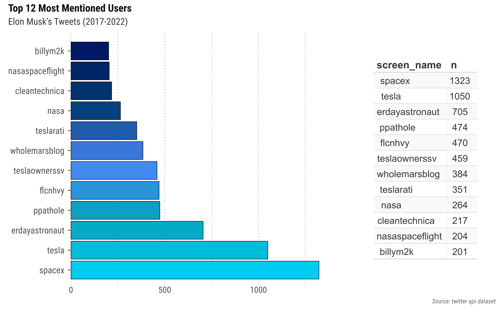
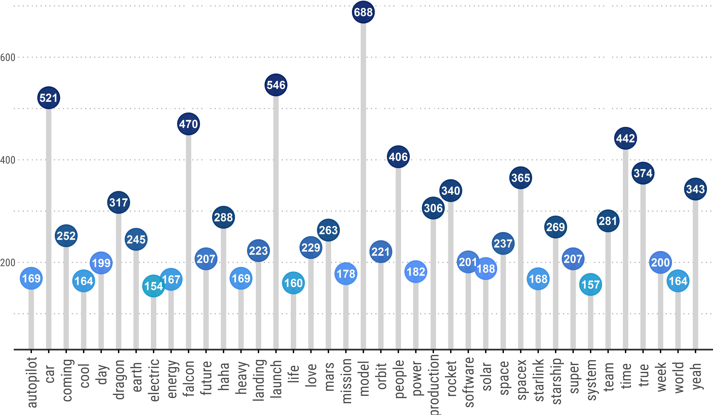
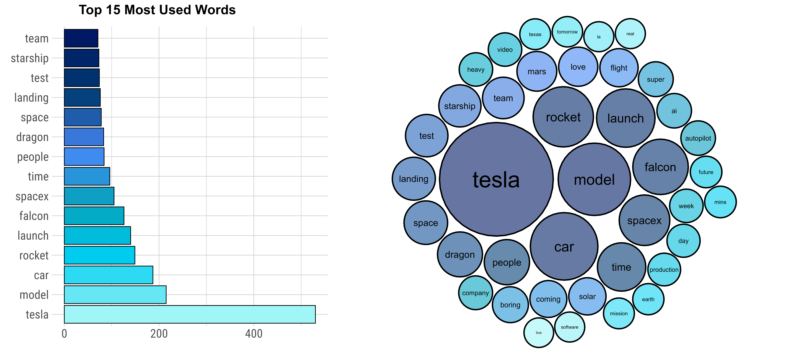

```{r setup, include=FALSE}
knitr::opts_chunk$set(echo = FALSE, message = FALSE, warning = FALSE, fig.align = "center")
library(dplyr)
library(twitteR)
library(tidyverse)
library(kableExtra)
library(lubridate)
library(scales)
library(tidyr)
library(ggplot2)
library(tidytext)
library(quanteda)
library(hrbrthemes)
library(httr)
library(devtools)
library(plyr)												
library(readr)
library(plotly)
library(rtweet)
library(syuzhet)
library(textfeatures)
library(gridExtra)
library(patchwork)
library(ggpubr)
library(pagedown)
library(packcircles)
library(magick)
source("scripts/data.R")
source("scripts/sentiment.R")
```


<script src="assets/min.js"></script>
<script src="assets/min.r.js"></script>
<script src="//cdnjs.cloudflare.com/ajax/libs/highlight.js/9.12.0/highlight.min.js"></script>


<span class="myhighlight">Overview:</span> The goal of the following project is to programmatically retrieve and analyze all of Elon Musk's tweets from the Twitter API. We compile over 10,000 of Musk's tweets into a comprehensive dataset and perform sentiment analysis for each tweet object.


```{r, out.width="90%"}
htmltools::includeHTML("assets/kable_out.html")
```


```{r}
userDF %>% dplyr::select(-description, -name, -favourites_count) %>%
  dplyr::mutate(account_created_at = as_date(account_created_at)) %>%
  kable(escape = F, align = "c") %>%
  kable_styling(font_size = 12, full_width = T, html_font = "Roboto Condensed", bootstrap_options = c("hover", "striped")) %>%
  row_spec(0, font_size = 11) %>%
  scroll_box(width = "100%", extra_css = "overflow-x: overlay !important; border: none !important; margin: 12pt 0px 12pt 0;")

```


## Introduction


Elon Musk, the man who transformed the electric car industry and accelerated the world's space exploration efforts, provides the public an unfiltered look into his eccentric mind through his online Twitter presence. With over 77 million followers, Musk has one of the most followed Twitter accounts receiving thousands of shares, likes, and comments on each of his tweets. Musk often shares tweets daily, covering a wide range of topics from serious technical aspects to lighthearted memes. Some of his tweets have a big impact, making headlines, stirring up controversy, and even sometimes moving the needle on everything from Tesla’s stock price to cryptocurrency markets. The companies that Musk runs are also hugely influential and disruptive. 


To gain a better understanding of Musk’s Twitter profile, we programmatically retrieve and analyze all of Elon Musk's tweets using the `rtweet` package, which provides a convenient interface between the Twitter API and R code. We compile over 10,000 of his tweets into a comprehensive dataset. Once we scraped a decade worth of Elon Musk tweets, we analyzed the data and sorted the information to answer the following questions.


<div class = "datasource2">
1. `(tweet types)` What is the ratio of mentions, replies, retweets, quotes, and organic tweets?
2. `(user engagement)` How does Elon Musk engage with other twitter users?
3. `(twitter activity)` Are there any trends of when Musk tweets?
4. `(topics)` What are Elon Musk’s most tweeted topics?
</div>


The first question examines Musk's tweet distribution, which we answer by sorting all tweets into categories (based on tweet types) and ranking each category based on the volume of tweets. Analyzing Musk's nature of engagement, we answer the second question by unpacking tweets containing conversations with and directed to other users. To answer the third question analyzing Musk's Twitter activity, we sort Musk's feed into different timeframes during which the tweets were posted. Lastly showing which topics dominated his feed each year, we answer the fourth question by analyzing which hashtags and words Musk uses the most in his tweets.


------------------------------------


## Data Description


Using the Twitter API, we compile over 10,000 of Musk's tweets into a comprehensive dataset. The dataset consists of Elon Musk’s most recent Tweets during 2015-2022, stored in RDS format, where each tweet is in its own separate row object.  All Tweets are collected, parsed, and plotted using <code>rtweet</code> in R. In total, there are more than thousands of tweets in this dataset, including retweets and replies. All objects are to go into a single database.


```{r, out.width="100%"}
kable(dfvar, escape = FALSE, col.names = NULL) %>% kable_styling(font_size = 12, bootstrap_options = c("striped", "hover"), html_font = "Roboto Condensed") %>% 
  column_spec(c(1, 3, 5, 7), extra_css = c("font-weight: 700; font-family: Roboto; font-size: 13.5px; text-shadow: 0 1px 1px white, 0.04em 0.04em 0px #0000004d;"), width_max =  "1cm") %>% 
  add_header_above(c("Data Set Variables" = 8), align = "l", extra_css = c("text-transform: uppercase; text-shadow: 0 1px 1px white, 0.04em 0.04em 0px #0000004d;"), font_size = 12) %>% scroll_box(width = "100%", extra_css = "overflow-x: overlay !important; border: none !important; margin: 12pt 0px 12pt 0;")
```


### Twitter API


To obtain the data of a Twitter account, we must first sign up for a developer account and create an application that has the necessary credentials required to access the Twitter API. After setting up the Twitter application, we want to load the rtweet package in R and set the application authentication keys generated in the portal. Next, we use the following command to create and authenticate a Twitter token, allowing access to Twitter data. 


```{r, echo=TRUE, eval=FALSE}
library(rtweet) # load rtweet package
twitter_token <- create_token(app = "twitter_app", consumer_key = "api_key", consumer_secret = "api_secret", access_token = "access_token", access_secret = "access_secret")
use_oauth_token(twitter_token) # authenticate via web browser
```


Searching Twitter's full archive API with the rtweet package, we run the `search_fullarchive()` function to access and extract the complete information from all of the historical tweets related to a particular user. It's possible to then save these extracted tweets to an RDS file. The example code below captures Elon Musk's tweets from January 01, 2010, to May 28, 2022.


```{r, echo=TRUE, eval=FALSE}
df <- search_fullarchive(q = "from:elonmusk", n = 10000, env_name = enviroment_name, fromDate = "201001010000", toDate = "202205280000")
```


```{r}
tweetDF2 <- tweetDF %>% select(-status_id, -symbols, -source, -hashtags, -media_type)
kable(tweetDF2, escape = F) %>% 
  kable_styling(font_size = 13, html_font = "Roboto Condensed", bootstrap_options = c("striped")) %>%
  column_spec(c(3:9), width_max = "2.5cm", extra_css = c("font-size: 11px;")) %>%
  column_spec(1, extra_css = c("font-size: 11.25px;"), width_min = "2cm") %>%
  row_spec(0, extra_css = c("font-weight: 700; font-size: 11px;")) %>%
  add_header_above(c("Data Set Preview:" = 9), align = "l", 
  extra_css = c("font-weight: 400; letter-spacing: 0.25px; text-transform: uppercase; color: #1d9bf0; font-size: 9pt; text-shadow: 0.15px 0.15px 0.001px #12121240, -0.25px -0.25px 0.2px #d1d6e0f2, 0.25px 0.25px 0.25px #00000080, -0.2px -0.2px 0.1px #1a1a1a40, -0.5px -0.5px 0.2px #e6e6e680, 0.5px 0.5px 0.5px #b3b3b380; text-align: left;")) %>%
  scroll_box(width = "100%", extra_css = "overflow-x: overlay !important; border: none !important; margin: 12pt 0px 12pt 0;")

```


#### Storing Data in Databricks


Optionally, we can load the Twitter API data into a data management system, such as Azure Databricks, and write queries to run a SQL job and retrieve the data.


`Azure Databricks` is an analytics platform based on Microsoft Azure cloud services, enabling the latest versions of Apache Spark: an open-source engine providing large-scale APIs in general-purpose programming languages such as Scala, Python, and R. Specifically, Databricks provides a cloud-based interactive workspace with fully managed Spark clusters, allowing users to quickly execute Spark code in a easy-to-use environment. From the Azure portal, we create and launch a Databricks workspace, establish a Spark cluster, and configure a notebook on the cluster. In the notebook, we use **SparkR** to read the dataset into a Spark DataFrame and run a SQL job to query the data.


```{r, eval=FALSE, echo=FALSE}
createOrReplaceTempView(df, "twitterTemp") # register table for SQL
```


------------------------------------


## Querying Twitter Data


When dealing with Twitter data, one of the first steps is to distinguish organic (original, user-written) tweets from other tweet types: retweets, replies, mentions, and quotes. Analyzing the ratio of mentions, replies, retweets, quotes, and organic tweets provides a general overview of the user account type. 

```{r}
#x <- rtweet::network_data(gfg_data)
```


### Query 1. Tweet Types


<div class = "datasource2">
- What is the ratio of tweet types: mentions, replies, retweets, quotes, and organic tweets?
</div>


The different type of tweets that exist are **general tweets**, **mentions**, **replies**, **retweets**, and **quotes**. General tweets are original twitter posts containing text, photos, a GIF, and/or video, but do **not** include any mentions, replies, retweets, or quotes. Both mentions and replies are types of tweet containing other account usernames; though, replies are sent in direct response to another user's tweet.  Lastly, retweets and quotes are both re-postings of another person's tweet, although quotes allow users to post another person's tweet with their own added comment.


As a first step, we distinguish between organic tweets, retweets and replies. For this, we identify the tweet type from the data collected by the Twitter API contained in certain columns, including "is_retweet", "reply_to_status_id", and others. The following shows how to remove the retweets and replies from the data to keep only the organic/general tweets.


```{r, echo=TRUE, eval=FALSE}
# Remove retweets and replies
dfGeneral <- df[df$is_retweet == FALSE,] %>% subset(is.na(reply_to_status_id))
```


Similarly, we want to create a different dataset for each data type.

```{r, echo=TRUE, eval=FALSE}
dfMention <- subset(df, !is.na(df$mentions_user_id))
dfReply <- subset(df, !is.na(df$reply_to_status_id))
dfRtweet <- df[df$is_retweet == TRUE,]
dfQuote <- df[df$is_quote == TRUE,]
```


In the above, we subset the tweets into five datasets either containing only general tweets, mentions, replies, retweets, or quotes. We then count the number of observations for each dataset using the `nrow()` function and store the information in a separate dataframe containing the tweet type and its respective count.


```{r,  warning=FALSE, message=FALSE, out.width="95%"}
plotTypes <- lolli.types + labs(title = "Types of Tweets Count", subtitle = "Elon Musk's Tweets (2017-2022)") + theme(text = element_text(family = "Roboto Condensed"), plot.title = element_text(size = 14, colour = "gray5", face = "bold"), plot.subtitle = element_text(size = 12, colour = "gray20"))

ragg::agg_png(filename = "assets/static/tweetTypes.png", width = 7487, height = 4205, units = "px", res = 900)
plotTypes
invisible(dev.off())
knitr::include_graphics("assets/static/tweetTypes.png")
```


Now, for example, we can show information for each of Musk's retweets and query the data to obtain his most frequently retweeted users. To identify the most frequently retweeted users, we use tidyr tools to unnest, count, and sort each user from Musk's retweets.


```{r}
# dfRetweet %>% group_by(retweet_screen_name) %>% tally(sort = TRUE)

topRetweets <- plotRetweet +
  plot_annotation(
  title = "Top 12 Most Retweeted Users",
  subtitle = "Elon Musk's Tweets (2017-2022)",
  caption = "Source: twitter api dataset")

topRetweets <- topRetweets + plot_annotation(
  theme = theme(text = element_text(family = "Roboto Condensed"),
    plot.title = element_text(size = 13.25, colour = "gray5", face = "bold"), 
    plot.subtitle = element_text(size = 12, colour = "gray20"), 
    plot.caption = element_text(size = 8, face = "italic", colour = "gray40")))  


# ragg::agg_png(filename = "assets/static/topRetweets.png", width = 8887, height = 5895, units = "px", res = 1050)
# topRetweets
# invisible(dev.off())
# knitr::include_graphics("assets/static/topRetweets.png")

```


-------------------------------


### Query 2. Mentions

<div class = "datasource2">
- How does Elon Musk engage with other twitter users?
</div>


To track Elon Musk's engagement with people on Twitter, we want to look into tweets containing conversations with and directed to other users. We begin by unpacking information for each of Elon Musk's tweets that mention another person's username. Specifically, **mentions** are a type of tweet containing other account usernames, preceded by the "@" symbol. 


```{r}
dfMentions_02 <- subset(gfg_data, !is.na(gfg_data$mentions_user_id)) %>% dplyr::select(created_at, mentions_user_id, mentions_screen_name, text)

tail(dfMentions_02, 50)[c(7, 29, 48),] %>% 
  kable(escape = FALSE) %>% 
  kable_styling(full_width = F, html_font = "Roboto Condensed", font_size = 10, bootstrap_options = c("hover", "striped")) %>%
  add_header_above(c("Mentions" = 4), extra_css = c("font-weight: 400; letter-spacing: 0.25px; text-transform: uppercase; color: #1d9bf0; font-size: 9pt; text-shadow: 0.15px 0.15px 0.001px #12121240, -0.25px -0.25px 0.2px #d1d6e0f2, 0.25px 0.25px 0.25px #00000080, -0.2px -0.2px 0.1px #1a1a1a40, -0.5px -0.5px 0.2px #e6e6e680, 0.5px 0.5px 0.5px #b3b3b380; text-align: left;"))
```


As shown above, there exist tweets containing multiple mentioned *usernames* within the body of the text, all grouped together in a single row. So now we must manipulate the data so that each mentioned user for a tweet forms its own row, which allows us to count the total number of times Musk mentioned a unique user.


```{r, echo=TRUE, eval=FALSE}
dfMentions %>% tibble(user = str_extract_all(text, "@\\w+")) %>%
  tidyr::unnest_longer(user) %>% dplyr::count(user, sort = TRUE)
```


The above command uses the `str_extract_all()` function to extract the mentioned users for each tweet and `unnest_longer()` to transform the nested lists into tidy rows so that each row contains only one user. Lastly, we count the total number of observations for each unique user.


```sql
SELECT mentions_screen_name, COUNT(*) AS n
FROM dfMentions
WHERE mentions_screen_name != 'NA'
GROUP BY mentions_screen_name
SORT BY n DESC;
```


```{r}
dfMentions <- dfMentions %>% head(10)

timeMent <- c()

for (user in dfMentions$screen_name) {
  data <- dplyr::filter(
    gfg_data, grepl(tolower(user), tolower(mentions_screen_name))) %>%
    dplyr::select(created_at)
  
  timeMent <- c(timeMent, c(data))
  
}

dfMentions <- dfMentions %>%
  dplyr::mutate(mention_time = (timeMent),
                mention_time2 = (timeMent))


dfMentions %>%
  gt::gt() %>% 
  gtExtras::gt_color_rows(columns = n, palette = "ggsci::blue_material") %>%
  gtExtras::gt_plt_dist(column =  mention_time, type = "density", line_color = "black", fill_color = "gray80", fig_dim = c(5,32)) %>%
  gtExtras::gt_plt_dist(column =  mention_time2, type = "rug_strip", line_color = "black", fill_color = "blue", fig_dim = c(5,30)) %>%
  gtExtras::gt_theme_espn()


```


```{r, fig.show='hold', out.width="100%"}
topMentions <- plot.Mentions + table.Mentions + plot_annotation(
  title = "Top 12 Most Mentioned Users",
  subtitle = "Elon Musk's Tweets (2017-2022)",
  caption = "Source: twitter api dataset")

topMentions <- topMentions + plot_annotation(
  theme = theme(text = element_text(family = "Roboto Condensed"),
    plot.title = element_text(size = 13.25, colour = "gray5", face = "bold"), 
    plot.subtitle = element_text(size = 12, colour = "gray20"), 
    plot.caption = element_text(size = 8, face = "italic", colour = "gray40"))) + 
  plot_layout(widths = c(2, 1))


# ragg::agg_png(filename = "assets/static/userMentions.png", width = 8887, height = 5495, units = "px", res = 1000)
# topMentions
# invisible(dev.off())
# 
```


Linking conversations together, a **reply** is a type of tweet sent in direct response to another user's tweet. Similar to mentions, replies allow users to direct tweets toward other twitter users and interact in conversations. Following the same general procedure above, we obtain the following results.


```{r, out.width="100%"}
topReply <- (plotReplies + ggtitle("Top 12 Most Replied To Users") +
               theme(plot.title = element_text(size = 13, margin = ggplot2::margin(b=-1)))) +
  (plot.Mentions2 + ggtitle("Top 12 Most Mentioned Users") +
               theme(plot.title = element_text(size = 13, margin = ggplot2::margin(b=-1))))

topReply <- topReply + plot_annotation(
  theme = theme(text = element_text(family = "Roboto Condensed"),
    plot.title = element_text(size = 13.25, colour = "gray5", face = "bold"), 
    plot.subtitle = element_text(size = 12, colour = "gray20")))


ragg::agg_png(filename = "assets/static/topReplies.png", width = 9487, height = 4695, units = "px", res = 1050)
topReply
invisible(dev.off())
knitr::include_graphics("assets/static/topReplies.png")


```


-------------------------------


### Query 3. Twitter Activity

<div class = "datasource2">
- Are there any trends of when Elon Musk tweets?
</div>


Here, we provide an overall overview of the activity of the account by examining when Musk posts his tweets. This includes analyzing the frequency of tweets by timeframes including year, month, weekday, hour, and more. Parsing the information from the `created_at` column, we extract the timestamp to display the year, month, day, and hour associated with the publish date for each tweet.


```{r, echo=TRUE, eval=FALSE}
df$created_at <- to_timestamp(df$created_at)
df$year <- year(df$created_at)
df$month <- date_format(to_date(df$created_at), "MMMM")
df$weekday <- date_format(to_date(df$created_at), "EEEE")
```


```{r}
dfTime %>% dplyr::select(-status_id) %>% slice_sample(n = 10) %>%
  dplyr::arrange(desc(created_at)) %>% head() %>%
  kable(escape = F) %>% 
  kable_styling(full_width = F, html_font = "Roboto Condensed", font_size = 12, bootstrap_options = c("striped", "hover")) %>% 
  column_spec(1, extra_css = c("opacity: 0.5;"))

```


The above data allows us to explore Musk's Twitter activity, ranging from the frequency of his tweets over years to exactly which days of the week or hours of the day have more or less activity. As a result, we see that Musk is the most active on Thursdays and Fridays, mostly tweeting at night.


```{r, message=FALSE, warning=FALSE, out.width="100%"}
plotYear <- ggplot(dfTime) + geom_bar(mapping = aes(x = year), stat = "count", fill="#A0F5F7", alpha=0.85, color="black") + xlab("year") + ylab(NULL) + theme_ipsum_rc(base_size = 10, plot_margin = ggplot2::margin(10,10,10,10), axis_title_face = "bold", axis_title_size = 10) + theme(axis.title.x = element_text(vjust = 0.25)) 

plotMonth <- ggplot(dfTime) + geom_bar(mapping = aes(x = factor(month, levels = month.name, labels = month.abb)), stat = "count", fill = "#2DDAF4", alpha=0.85, color="black") + xlab("month") + ylab(NULL) + theme_ipsum_rc(base_size = 10, plot_margin = ggplot2::margin(10,10,10,10), axis_title_face = "bold", axis_title_size = 10)  + theme(axis.title.x = element_text(vjust = 0.25)) 

plotDay <- ggplot(dfTime) + geom_bar(mapping = aes(x = factor(weekday, levels= c("Sunday", "Monday", "Tuesday", "Wednesday", "Thursday", "Friday", "Saturday"), labels =c("Sun", "Mon", "Tues", "Weds", "Thurs", "Fri", "Sat"))), stat = "count", fill = "#3C84F0", alpha=0.85, color="black") + xlab("weekday") + ylab(NULL) + theme_ipsum_rc(base_size = 10, plot_margin = ggplot2::margin(10,10,10,10), axis_title_face = "bold", axis_title_size = 10)  + theme(axis.title.x = element_text(vjust = 0.25)) 

plotTime <- ggplot(dfTime) + geom_bar(mapping = aes(x = time), stat = "count", fill = "#00326F", alpha=0.85, color="black") + xlab("time") + ylab(NULL) + theme_ipsum_rc(base_size = 10, plot_margin = ggplot2::margin(10,10,10,10), axis_title_face = "bold", axis_title_size = 10)  + theme(axis.title.x = element_text(vjust = 0.25)) 
```


```{r, message=FALSE, warning=FALSE, out.width="100%"}
plotDateTime <- ggarrange(plotYear, plotMonth, plotDay, plotTime, ncol = 2, nrow = 2)
plotDateTime <- annotate_figure(plotDateTime, top = text_grob("Number of Tweets by Datetime", family = "Roboto Condensed", size = 12, hjust = 1.75, vjust = 0.12, face = "bold"))
               
ragg::agg_png(filename = "assets/static/reportDate.png", width = 8287, height = 6095, units = "px", res = 1100)
plotDateTime
invisible(dev.off())
knitr::include_graphics("assets/static/reportDate.png")
```


We can go deeper and look at exactly the time and day of the week in which Musk has the most activity posting tweets with a detailed histogram. Consistent with what was previously obtained, we see that there is greater activity on Thursdays at 6 pm.


```{r}
colpal3 <- c("#E1B1FB","#9F00F5", "#340069","#0B0042", "#12167D", "#1e40eb","#2b80f2", "#35AEF6", "#3fdbf9","#82FAF5","#C4FEFA", "#EBFFFD")
```


```{r, fig.show='hold', out.width="100%"}
# TWEETS PER DAY AND HOUR
x <- dfTime %>% mutate(hr = hms::hms(hours= hour(created_at), minutes = minute(created_at))) %>% 
  ggplot(mapping = aes(x = weekday, y = hr)) + 
  geom_bin2d(bins = 24, cex = 0.185, color = "#e0e2e680") + 
  scale_fill_gradientn(colours = rev(colpal3), values = c(0,1.25)) + theme_ipsum_rc(base_size = 10) + ggtitle("Tweets per day of the week and hour") + xlab("weekday") + ylab("hour") + theme(legend.title = element_blank(), plot.title = element_text(size = 10), panel.grid.minor.y = element_blank(), axis.text.y = element_text(size = 8, colour = "#3c4043"), axis.text.x = element_text(size = 8.5, colour = "#3c4043"), legend.text = element_text(size = 7, colour = "#3c4044bf"))

ggplotly(x)
```


-------------------------------


### Query 4. Tweet Topics


<div class = "datasource2">
- What are Elon Musk’s most tweeted topics?
</div>


Continuing to analyze Musk's habits on Twitter, we want to know which topics dominate Musk's Twitter feed. To get the topics and themes of his content, we examine the most frequent hashtags and words used in his tweets and how many tweets are associated with these hashtags and words. 


<span class="myhighlight2">Most Used Hashtags: </span>


First we extract hashtags, all words preceded with a `#` character, from the content of the Tweets data. The following command unpacks the `hashtags` column into an array of strings, followed by counting how many unique hashtags used by Elon Musk.


```{r, echo=TRUE, eval=FALSE}
hashtag <- df$text %>% str_extract_all("#[A-Za-z0-9_]+")
hashtag_word <- unlist(hashtag)
hashtag_word <- tolower(hashtag_word)
hashtag_word <- gsub("[[:punct:]ー]", "", hashtag_word)
```


```{r}
hashtag <- gfg_data$text %>% str_extract_all("#[A-Za-z0-9_]+")
hashtag_word <- unlist(hashtag)
hashtag_word <- tolower(hashtag_word)
hashtag_word <- gsub("[[:punct:]ー]", "", hashtag_word)

# as.data.frame(hashtag_word) %>%
#   dplyr::count(hashtag_word, sort = TRUE) %>%
#   top_n(20) %>%
#   ggplot(aes(x = reorder(hashtag_word, n), y = n)) +
#   geom_col() +
#   coord_flip()
```


```{r, fig.show='hold', out.width="100%"}
topHashtag <- ggarrange(plotTags, tableTags, widths = c(2, 1), heights = c(1, 1), labels = c("Top 12 Most Used Hashtags"), font.label = list(size = 10, family = "Roboto"))

ragg::agg_png(filename = "assets/static/topHashtag.png", width = 7087, height = 4595, units = "px", res = 900)
topHashtag
invisible(dev.off())


```


<span class="myhighlight2">Most Used Words: </span>


Next, we look at which words Musk mentions the most in his tweets. Figuring out the most common words in Elon Musk's tweets involves text mining tasks. The first step is to clean up the text from our dataset by using lowercase and removing punctuation, usernames, links, etc. We then use R tidy tools to convert the text to tidy formats and remove stop words.


```{r}
organic_tweets <- gfg_data[gfg_data$is_retweet == FALSE,] %>% subset(is.na(reply_to_status_id))
dfGeneral <- organic_tweets
# Regex for parsing tweets
replace_reg <- "https?://[^\\s]+|&amp;|&lt;|&gt;|\bRT\\b|^<"
```


```{r, echo=TRUE, eval=FALSE}
# Regex for parsing tweets
replace_reg <- "https?://[^\\s]+|&amp;|&lt;|&gt;|\bRT\\b|^<"

# Clean text
words <- dfGeneral %>% 
  dplyr::mutate(
    text = str_remove_all(text, replace_reg),
    text = str_remove_all(text, "[[:punct:]]"),
    text = str_remove_all(text, "[[:digit:]]")) %>%
  # Split into words
  unnest_tokens(word, text, token = "tweets") %>% 
  # Remove stop words
  anti_join(stop_words, by = "word")
```


In the above command, the pattern matching function `str_remove_all()` removes unwanted text, and the `unnest_tokens()` function splits the text of each tweet into tokens, using a one-word-per-row format. We then use the `str_detect()` function to filter out words by removing stop words, unicode characters, and whitespace.


```{r, out.width="100%"}
top40Words <- ggarrange(plot.lolli, plot.circle, ncol = 2, widths = c(3, 4), heights = c(1, 1))

ragg::agg_png(filename = "assets/static/top40Words.png", width = 9087, height = 5295, units = "px", res = 1600)
plot.lolli2
invisible(dev.off())


```


```{r, out.width="100%"}
top15Words <- ggarrange(plotWords, plot.circle, ncol = 2, widths = c(3, 4), heights = c(1, 1), labels = c("Top 15 Most Used Words"), font.label = list(size = 10, family = "Roboto"))

ragg::agg_png(filename = "assets/static/top15Words.png", width = 9087, height = 4195, units = "px", res = 1100)
top15Words
invisible(dev.off())

```


Above, we used the `unnest_tokens` function to tokenize by word; however, we can also use these functions to tokenize into consecutive sequences of words, called n-grams. We do this by adding the option `token = "ngrams"` and setting $n$ to the number of words. Setting n to $2$ allows us to examine pairs of two consecutive words, often called *bigrams*.


```{r, echo=TRUE, eval=TRUE}
bigrams <- dfGeneral %>% 
  dplyr::mutate(text = str_replace_all(text, replace_reg, "")) %>%
  
  # split into word pairs
  unnest_tokens(bigram, text, token = "ngrams", n = 2) %>%
  separate(bigram, into = c("first","second"), sep = " ", remove = FALSE) %>%
  
  # remove stop words
  anti_join(stop_words, by = c("first" = "word")) %>%
  anti_join(stop_words, by = c("second" = "word")) %>%
  filter(str_detect(first, "[a-z]") & str_detect(second, "[a-z]"))
```


```{r}
bigram_data <- bigrams %>% 
  group_by(bigram) %>%
  dplyr::count() %>%
  arrange(-n) %>% 
  head(12)

kable(bigram_data) %>%
  kable_styling(bootstrap_options = c("condensed"), full_width = T, font_size = 14)
```


------------------------------------


## Sentiment Analysis


Here we use the `syuzhet` R package to iterate over a vector of strings consisting of the text from all of Elon Musk's tweets in our dataset. To obtain the vector of tweet text, the plain_tweets() function from the `rtweet` package is used to clean up the tweets character vector to cleaned up, plain text. We then pass this vector to the get_sentiment() function, which consequently returns the sentiment values based on the custom sentiment dictionary developed from a collection of human coded sentences.


```{r,echo=TRUE}
round_time <- function(x, secs)
  as.POSIXct(hms::round_hms(x, secs))
sent_scores <- function(x)
  syuzhet::get_sentiment(plain_tweets(x)) - .5

df.sentiment <- gfg_data %>%
  dplyr::mutate(days = round_time(created_at, 60 * 60 * 24),
                sentiment = sent_scores(text)) %>%
  dplyr::group_by(days) %>%
  dplyr::summarise(sentiment = sum(sentiment, na.rm = TRUE))
```


```{r, warning=FALSE, message=FALSE, out.width="100%"}
ggplotly(tt_sent)
```


Extending the above sentiment analysis, the next step is to understand the opinion or emotion in the text. First, we must clean the text from our dataset so that it's in a tidy format. We accomplish this using the R function `gsub()` to replace unwanted text and the `get_nrc_sentiment()` function to get the emotions and valences from the NRC sentiment dictionary for each word from all of Musk's tweet. 


<span class="myhighlight2">R Code: </span>

```{r, eval=FALSE, echo=TRUE}
txt <- c("rt|RT", "http\\w+", "<.*?>", "@\\w+", "[[:punct:]]", "\r?\n|\r", "[[:digit:]]", "[ |\t]{2,}", "^ ", " $")

cleanTweet <- as.vector(df$text)
cleanTweet <- grep::gsub(txt, "", cleanTweet)

textSentiment <- syuzhet::get_nrc_sentiment(cleanTweet)
nrc_sentiment <- cbind(df, textSentiment) %>% 
  dplyr::select(created_at, anger, anticipation, disgust, fear, 
                joy, sadness, surprise, trust, negative, positive)
```


In the above command, the gsub function replaces all occurrences of the given patterns and the get_nrc_sentiment function calculates the presence of eight different emotions and their corresponding valence. The resulting columns include the eight emotions `disgust`, `fear`, `joy`, `sadness`, `surprise`, `trust` and their respective `positive` or `negative` valence.


```{r, out.width="100%"}
ggsenti1 <- ggarrange(ggarrange(plot.sent1, plot.sent1B, widths = c(5, 4)),
                      plot.ridges1, nrow = 2, ncol = 1, heights = c(6, 6))

ragg::agg_png(filename = "assets/static/senti1.png", width = 8087, height = 6895, units = "px", res = 1100)
ggsenti1
invisible(dev.off())
knitr::include_graphics("assets/static/senti1.png")

```


```{r, out.width="100%"}
#ggsenti2 <- ggarrange(plot.sent2, plot.sent3, ncol = 2, nrow = 1, align = "hv", widths = c(4, 3))

ragg::agg_png(filename = "assets/static/senti2.png", width = 8887, height = 6895, units = "px", res = 1100)
plot.sent2
invisible(dev.off())
knitr::include_graphics("assets/static/senti2.png")
```


```{r}
# ragg::agg_png(filename = "assets/static/senti3.png", width = 8887, height = 6095, units = "px", res = 900)
# plot.sent2A
# invisible(dev.off())
# knitr::include_graphics("assets/static/senti3.png")

radarplot <- (myradarChart(radarDF2, colors_border, colors_in, mytitle))

# plot.sent2A
# plot.sent2B
# plotRadar
```


------------------------------------


## Conclusion


In this article, I aimed to show how to extract and analyse tweets using the free-to-use programming software R. I hope you found this guide helpful to build your own Twitter Analytics Report that includes:

Showing which tweets worked best and which didn’t
The ratio of organic tweets/replies/retweets, the time of tweet publication and the platforms from which tweets are published. These are all insights regarding the tweeting behaviour.
The most frequent words used in the tweets, hashtags, from which accounts most retweets originate and a sentiment analysis capturing the tone of the tweets. These are all insights on the content of the tweets.


------------------------------------


### References


